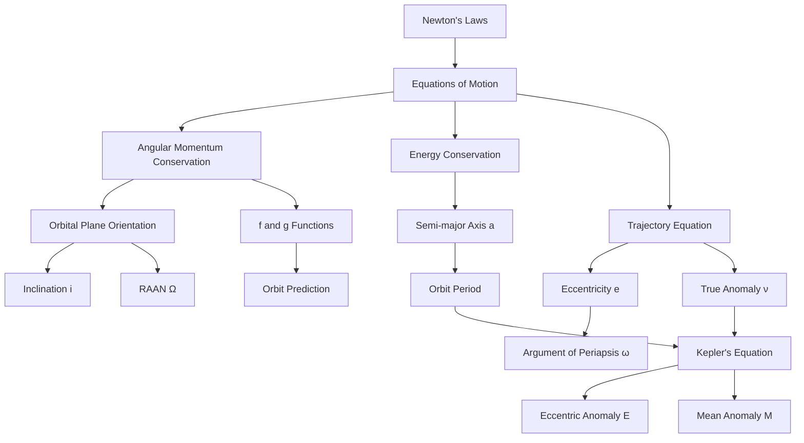
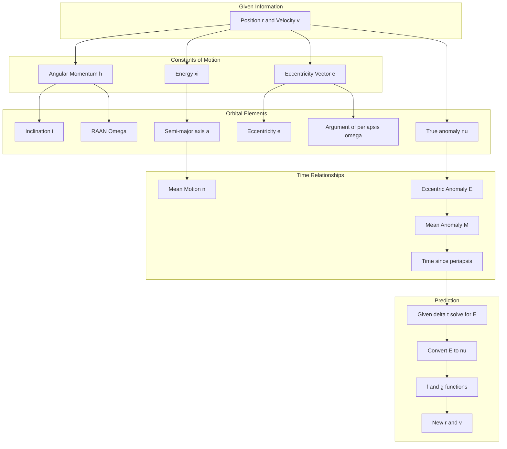

# SPCE 5025: Astronautics and Orbital Mechanics

## Overview

This course provides a rigorous foundation in astronautics, focusing on Earth-orbiting satellites. We build from Newton's laws to derive the complete mathematical framework for describing and predicting satellite motion.

### Big Picture: What We're Building

The central problem of astronautics is deceptively simple: **Given where a satellite is now, where will it be later?** Answering this requires understanding:
1. Why satellites move in ellipses (trajectory equation)
2. How to describe an orbit's shape and orientation (orbital elements)
3. How to relate position to time (Kepler's equation)

### Topic Dependencies



### Course Information
- **Instructor:** Ed Brown
- **Schedule:** Tuesdays (Lecture), Thursdays (Office Hours), 7:00 PM Mountain Time
- **Primary Text:** Vallado, *Fundamentals of Astrodynamics and Applications*, 5th Edition
- **Supplementary:** Goddard Trajectory Determination System Mathematical Theory (1989)

---

# CLASS 1: Foundations of Orbital Mechanics
*(Reference: SPCE5025_Class_1_r1.pdf)*

---

## Topic 1: Kepler's Laws — The Observational Foundation

### Analogy
Imagine you're watching cars on a racetrack from above. Johannes Kepler was like an observer who, without knowing anything about engines or physics, noticed patterns in how the "cars" (planets) moved around the track. He wrote down three rules that perfectly described what he saw, even though he couldn't explain *why* they worked.

### Core Explanation
In the early 1600s, Kepler analyzed decades of planetary observations and discovered three empirical laws—patterns that held true without any underlying theory. These laws were later *explained* by Newton's physics, but they remain useful as quick checks on our mathematical derivations.

### Formal Definitions
*(Class 1, Page 7)*

**Kepler's First Law (Law of Ellipses):**
> The orbit of a satellite is an ellipse with the central body at one focus.

**Kepler's Second Law (Law of Equal Areas):**
> The line joining the central body and satellite sweeps out equal areas in equal time.

**Kepler's Third Law (Harmonic Law):**
> The square of the satellite's orbital period is proportional to the cube of the mean distance from the central body.

Mathematically:

$$T_P^2 \propto a^3$$

### Why These Laws Matter
- **First Law:** Tells us the *shape* of orbits (ellipses, not circles)
- **Second Law:** Tells us satellites move *faster* when closer to Earth
- **Third Law:** Lets us calculate orbital period from orbit size

### Key Takeaways
1. Kepler's laws are observational facts that any valid orbital theory must reproduce
2. We will derive all three laws from Newton's physics
3. The central body is at a *focus*, not the *center*, of the ellipse

---

## Topic 2: Newton's Laws — The Physical Foundation

### Analogy
If Kepler described *what* satellites do, Newton explained *why*. Newton gave us the "rules of the game" that govern all motion—like knowing the rules of chess rather than just observing that certain pieces tend to move certain ways.

### Core Explanation
Newton's three laws of motion, combined with his law of universal gravitation, provide the complete foundation for classical orbital mechanics. Everything we derive follows from these principles.

### Formal Definitions
*(Class 1, Page 8)*

**Newton's First Law (Inertia):**
> An object in motion moves in a straight line unless acted on by an outside force.

This explains why satellites don't just fly off into space—gravity constantly pulls them toward Earth.

**Newton's Second Law (Force and Acceleration):**

$$\vec{F} = m\vec{a}$$

More precisely:

$$\vec{F} = \frac{d}{dt}(m\vec{v})$$

For constant mass, this reduces to $\vec{F} = m\vec{a}$.

**Newton's Third Law (Action-Reaction):**
> Every force has an equal and opposite reaction force.

When Earth pulls on a satellite, the satellite also pulls on Earth (though Earth barely moves due to its much larger mass).

### The Inverse Square Law of Gravitation
*(Class 1, Page 9)*

At planetary scales, gravitational force follows an inverse square relationship with distance:

$$f \propto \frac{1}{r^2}$$

The gravitational force exerted by mass $m_2$ on mass $m_1$ is:

$$f_{grav,1} = \frac{Gm_1m_2}{r^2}$$

In vector form, pointing from $m_1$ toward $m_2$:

$$\vec{f}_{grav,1} = \frac{Gm_1m_2}{r^3}\vec{r}$$

where $\vec{r}$ is the position vector from $m_1$ to $m_2$.

### Gravitational Acceleration
*(Class 1, Page 10)*

The gravitational acceleration experienced by a small mass $m$ due to a large mass $M$ separated by distance $r$:

$$a_{grav} = \frac{GM}{r^2}$$

The force on $m$:

$$f_m = ma_{grav} = \frac{GMm}{r^2}$$

As a vector (with direction toward $M$):

$$\vec{f}_m = -\frac{GMm}{r^2}\frac{\vec{r}}{r} = -\frac{GMm}{r^3}\vec{r}$$

The negative sign indicates the force points *toward* $M$ (opposite to $\vec{r}$ which points away from $M$).

### Quick Check
*Why does gravitational force have an inverse square dependence on distance?*

This arises from geometry: the gravitational "influence" spreads out over the surface of a sphere, whose area is $4\pi r^2$. As distance doubles, the area quadruples, so the intensity decreases by a factor of four.

---

## Topic 3: The Two-Body Problem — Setting Up the Equations

### Analogy
Imagine two dancers connected by an invisible elastic band. Each dancer affects the other's motion, but if one dancer is much heavier (like a sumo wrestler dancing with a child), the heavy dancer barely moves while the light dancer orbits around. This is the two-body problem simplified.

### Core Explanation
Our goal is to describe how a satellite moves through space when subject only to gravitational attraction from a single central body. We'll make several simplifying assumptions that let us find an exact mathematical solution.

### The Goal
*(Class 1, Page 11)*

> Find a way to describe the motion through space of a satellite subject to an inverse square gravitational force.

**Important Note:** This derivation requires *no assumption* that the mass $m$ is "in orbit" about $M$. We're solving an idealized problem about point masses in space. "In orbit" simply means the satellite moves without hitting the ground.

### Defining the Reference Frame
*(Class 1, Page 13)*

All derivations use vector quantities measured in a **Cartesian coordinate system** with three mutually orthogonal directions ($\hat{i}$, $\hat{j}$, $\hat{k}$ or $\hat{X}$, $\hat{Y}$, $\hat{Z}$).

These characteristic directions are **fixed in space**—an **inertial reference frame**. Using non-moving coordinate axes greatly simplifies the mathematics.

### Deriving the Equations of Motion
*(Class 1, Page 14)*

**Setup:**
- Define position vectors with respect to an arbitrary origin
- Let $\vec{r}_M$ = position of central body $M$
- Let $\vec{r}_m$ = position of satellite $m$
- Let $\vec{r} = \vec{r}_m - \vec{r}_M$ = relative position vector

**Accelerations of each body:**

The satellite accelerates toward $M$:

$$\ddot{\vec{r}}_m = -\frac{GM}{r^3}\vec{r}$$

The central body accelerates toward $m$:

$$\ddot{\vec{r}}_M = \frac{Gm}{r^3}\vec{r}$$

(Positive sign because the force on $M$ points in the $+\vec{r}$ direction)

**Relative acceleration:**

$$\ddot{\vec{r}} = \ddot{\vec{r}}_m - \ddot{\vec{r}}_M$$

$$\ddot{\vec{r}} = -\frac{GM}{r^3}\vec{r} - \frac{Gm}{r^3}\vec{r}$$

$$\ddot{\vec{r}} = -\frac{G(M+m)}{r^3}\vec{r}$$

**Key Simplification:** If $M \gg m$ (Earth's mass is approximately $10^{24}$ kg, satellites are approximately $10^3$ kg):

$$\boxed{\ddot{\vec{r}} = -\frac{GM}{r^3}\vec{r}}$$

### Significant Assumptions
*(Class 1, Page 14)*

1. $M \gg m$ (satellite mass negligible compared to central body)
2. Gravitational field is smooth and spherically symmetric
3. Gravitational force emanates from a point at the center of $M$
4. No other forces act on the bodies (no drag, solar pressure, etc.)

### The Gravitational Parameter mu
*(Class 1, Page 15)*

**Definitions:**

| Quantity | Symbol | Value | Notes |
|----------|--------|-------|-------|
| Gravitational Constant | $G$ | $6.673 \times 10^{-11}$ m³/(kg·s²) | Poorly defined—hard to measure |
| Mass of Central Body | $M$ | varies | Also poorly defined for celestial bodies |
| Gravitational Parameter | $\mu = GM$ | varies | Well-defined from orbital motion |

For Earth:

$$\mu_{\oplus} = 3.986004418 \times 10^{14} \text{ m}^3/\text{s}^2 \text{ (WGS84 value)}$$

**Why use mu?** We can measure orbital motion very precisely, giving us an accurate value for the *product* $GM$, even though we can't measure $G$ or $M$ individually with high precision.

### The Fundamental Equation of Motion
*(Class 1, Page 16)*

$$\boxed{\ddot{\vec{r}} = -\frac{\mu}{r^3}\vec{r}}$$

This second-order vector differential equation requires **6 constants of integration** to fully describe the motion:
- 3 position components
- 3 velocity components

Or equivalently, 6 **orbital elements** (which we'll derive).

### Key Takeaways
1. The two-body problem assumes one mass dominates
2. The gravitational parameter $\mu = GM$ is known more precisely than $G$ or $M$ individually
3. We need 6 independent quantities to fully describe an orbit
4. The equations of motion are the starting point for all derivations

---

## Topic 4: Angular Momentum — The First Integral

### Analogy
Think of a figure skater pulling their arms in to spin faster. The product of how far the mass is from the spin axis and how fast it's rotating (angular momentum) stays constant. Similarly, a satellite's angular momentum is constant, which constrains it to move in a fixed plane.

### Core Explanation
By manipulating the equations of motion, we can show that a specific quantity—angular momentum—never changes. This "conservation law" has profound implications: it tells us the orbital plane is fixed in space and relates to Kepler's equal areas law.

### Derivation of Angular Momentum Conservation
*(Class 1, Page 17)*

**Definition of angular momentum:**

$$\vec{h} = \vec{r} \times \dot{\vec{r}}$$

**Step 1:** Take the cross product of $\vec{r}$ with the equation of motion:

$$\vec{r} \times \ddot{\vec{r}} = -\frac{\mu}{r^3}(\vec{r} \times \vec{r}) = 0$$

The cross product of any vector with itself is zero.

**Step 2:** Consider the time derivative of angular momentum:

$$\frac{d}{dt}(\vec{r} \times \dot{\vec{r}}) = \dot{\vec{r}} \times \dot{\vec{r}} + \vec{r} \times \ddot{\vec{r}}$$

The first term is zero (cross product of vector with itself).
The second term is zero (from Step 1).

**Step 3:** Therefore:

$$\frac{d}{dt}(\vec{r} \times \dot{\vec{r}}) = 0$$

**Step 4:** Integrate:

$$\vec{r} \times \dot{\vec{r}} = \vec{h} = \text{constant}$$

### Physical Interpretation
*(Class 1, Page 18)*

**What does constant angular momentum mean?**

1. **Constant direction:** The orbital plane has a fixed orientation in inertial space
   - $\vec{h}$ is perpendicular to both $\vec{r}$ and $\vec{v}$
   - Since $\vec{h}$ doesn't change direction, the plane containing $\vec{r}$ and $\vec{v}$ doesn't change

2. **Constant magnitude:** Related to Kepler's "equal areas in equal times"
   - The rate at which the satellite sweeps out area is proportional to $|\vec{h}|$

### Key Takeaways
1. Angular momentum $\vec{h} = \vec{r} \times \dot{\vec{r}}$ is conserved
2. Conservation of $\vec{h}$ means motion is confined to a plane
3. The direction of $\vec{h}$ tells us the orientation of the orbital plane
4. This gives us our first "orbital element" information

---

## Topic 5: Inclination — First Orientation Angle

### Analogy
If you tilt a coin on a table, the angle of tilt measured from the horizontal is like the inclination. For orbits, inclination measures how much the orbital plane is "tilted" relative to Earth's equator.

### Core Explanation
The inclination $i$ is the angle between the orbital plane and Earth's equatorial plane. It's one of two angles needed to fully specify the orientation of the orbital plane.

### Formal Definition and Derivation
*(Class 1, Page 19)*

The inclination is the angle between the angular momentum vector $\vec{h}$ and the $\hat{Z}$ axis (which points along Earth's rotation axis, perpendicular to the equator).

**Using the dot product:**

$$\hat{Z} \cdot \hat{h} = |\hat{Z}||\hat{h}|\cos i = \cos i$$

Since both are unit vectors:

$$\cos i = \hat{Z} \cdot \hat{h}$$

**Therefore:**

$$\boxed{i = \cos^{-1}(\hat{Z} \cdot \hat{h})}$$

**Range:** $i \in [0°, 180°]$

### Interpretation of Inclination Values

| Inclination | Orbit Type | Description |
|-------------|------------|-------------|
| $i = 0°$ | Equatorial, prograde | Orbit lies in equatorial plane, moves east |
| $0° < i < 90°$ | Prograde | Satellite has eastward motion component |
| $i = 90°$ | Polar | Orbit passes over both poles |
| $90° < i < 180°$ | Retrograde | Satellite has westward motion component |
| $i = 180°$ | Equatorial, retrograde | Orbit lies in equatorial plane, moves west |

### Worked Example 1
**Given:** $\vec{h} = (0, 0, h)$ (angular momentum points straight up along Z-axis)

**Find:** Inclination

**Solution:**

$$\hat{h} = \frac{\vec{h}}{|\vec{h}|} = (0, 0, 1)$$

$$\cos i = \hat{Z} \cdot \hat{h} = (0, 0, 1) \cdot (0, 0, 1) = 1$$

$$i = \cos^{-1}(1) = 0°$$

This is an equatorial orbit.

### Worked Example 2
**Given:** $\vec{h} = (0.5h, 0, 0.866h)$

**Find:** Inclination

**Solution:**

$$|\vec{h}| = h\sqrt{0.5^2 + 0 + 0.866^2} = h\sqrt{0.25 + 0.75} = h$$

$$\hat{h} = (0.5, 0, 0.866)$$

$$\cos i = \hat{Z} \cdot \hat{h} = 0.866$$

$$i = \cos^{-1}(0.866) = 30°$$

---

## Topic 6: Right Ascension of Ascending Node (RAAN)

### Analogy
Imagine a hula hoop tilted in space. The inclination tells you how much it's tilted, but you still need to know *which direction* it's tilted—is the high side pointing north, east, or somewhere else? The RAAN tells you the compass direction where the tilted hoop crosses the equator going upward.

### Core Explanation
The RAAN (symbol: $\Omega$) specifies where the orbital plane intersects the equatorial plane. Specifically, it measures the angle from the reference direction ($\hat{X}$, typically pointing toward the vernal equinox) to the point where the satellite crosses the equator moving from south to north.

### Formal Definition and Derivation
*(Class 1, Page 20)*

**The Ascending Node:** The point where the orbit crosses the equatorial plane moving northward (from negative to positive Z).

**The Node Vector:** Points from Earth's center toward the ascending node.

Since the ascending node lies in both the orbital plane (perpendicular to $\vec{h}$) and the equatorial plane (perpendicular to $\hat{Z}$), the node vector is perpendicular to both:

$$\hat{N} = \frac{\hat{Z} \times \hat{h}}{|\hat{Z} \times \hat{h}|}$$

**Components of the node vector:**

$$\hat{N} = (N_x, N_y, 0)$$

(The Z-component is zero because $\hat{N}$ lies in the equatorial plane)

**Computing RAAN:**

$$\boxed{\Omega = \text{atan2}(N_y, N_x)}$$

**Range:** $\Omega \in [0°, 360°]$

### The ATAN2 Function
*(Class 1, Page 21)*

**Why not just use arctan?**

The standard arctangent function returns values only in the range $(-90°, 90°)$, which doesn't account for which quadrant the angle is in.

The **atan2** function takes two arguments (y, x) and returns the angle in the correct quadrant:

| Quadrant | sin | cos | atan2 returns |
|----------|-----|-----|---------------|
| I | + | + | $[0°, 90°]$ |
| II | + | - | $(90°, 180°]$ |
| III | - | - | $(-180°, -90°)$ |
| IV | - | + | $[-90°, 0°)$ |

**Converting to [0, 360] degrees:** If atan2 returns a negative angle, add 360 degrees (or $2\pi$ radians).

### Worked Example
**Given:** $\vec{h} = (-0.5h, 0.5h, 0.707h)$

**Find:** RAAN ($\Omega$)

**Step 1:** Compute $\hat{Z} \times \hat{h}$

$$\hat{h} = \frac{1}{h}(-0.5h, 0.5h, 0.707h) = (-0.5, 0.5, 0.707)$$

$$\hat{Z} \times \hat{h} = \begin{vmatrix} \hat{i} & \hat{j} & \hat{k} \\ 0 & 0 & 1 \\ -0.5 & 0.5 & 0.707 \end{vmatrix}$$

$$= \hat{i}(0 \cdot 0.707 - 1 \cdot 0.5) - \hat{j}(0 \cdot 0.707 - 1 \cdot (-0.5)) + \hat{k}(0 \cdot 0.5 - 0 \cdot (-0.5))$$

$$= (-0.5, -0.5, 0)$$

**Step 2:** Normalize

$$|\hat{Z} \times \hat{h}| = \sqrt{0.25 + 0.25} = 0.707$$

$$\hat{N} = \frac{(-0.5, -0.5, 0)}{0.707} = (-0.707, -0.707, 0)$$

**Step 3:** Compute RAAN

$$\Omega = \text{atan2}(-0.707, -0.707) = -135° + 360° = 225°$$

---

## Topic 7: Energy Conservation — The Second Integral

### Analogy
A roller coaster at the top of a hill has lots of potential energy (height) but is moving slowly (low kinetic energy). At the bottom, it's moving fast (high kinetic energy) but has less potential energy. The total energy stays the same. Satellites work the same way—they move faster when closer to Earth.

### Core Explanation
By manipulating the equations of motion differently, we can show that another quantity—total mechanical energy—is conserved. This links the satellite's speed to its distance from Earth at any point in the orbit.

### Derivation of Energy Conservation
*(Class 1, Pages 22-25)*

**Step 1:** Rearrange the equation of motion:

$$\ddot{\vec{r}} + \frac{\mu}{r^3}\vec{r} = 0$$

**Step 2:** Take the dot product with $\dot{\vec{r}}$:

$$\dot{\vec{r}} \cdot \ddot{\vec{r}} + \frac{\mu}{r^3}\dot{\vec{r}} \cdot \vec{r} = 0$$

**Step 3:** Interpret as scalars.

For the first term, we need to understand the relationship between vectors and their magnitudes:

$$\dot{\vec{r}} \cdot \ddot{\vec{r}} = \vec{v} \cdot \dot{\vec{v}}$$

where $\vec{v} = \dot{\vec{r}}$ is velocity and $\dot{\vec{v}}$ is acceleration.

**Key insight:** *(Class 1, Page 23)*

$$\vec{r} \cdot \dot{\vec{r}} = r \cdot v \cdot \cos\gamma = r \cdot \dot{r}$$

where $\gamma$ is the angle between $\vec{r}$ and $\vec{v}$, and $\dot{r}$ is the rate of change of the *magnitude* of $\vec{r}$ (not the vector!).

Similarly:

$$\dot{\vec{r}} \cdot \ddot{\vec{r}} = v \cdot \dot{v}$$

**Critical Note:** $\dot{r} \neq |\dot{\vec{r}}|$. The scalar $\dot{r}$ is the rate of change of distance from the center, while $|\dot{\vec{r}}|$ is the speed.

**Step 4:** The equation becomes:

$$v\dot{v} + \frac{\mu}{r^3}r\dot{r} = v\dot{v} + \frac{\mu}{r^2}\dot{r} = 0$$

**Step 5:** Recognize these as time derivatives:

$$\frac{d}{dt}\left(\frac{v^2}{2}\right) = \frac{2v\dot{v}}{2} = v\dot{v}$$

$$\frac{d}{dt}\left(-\frac{\mu}{r}\right) = \frac{\mu}{r^2}\dot{r}$$

**Step 6:** Combine:

$$\frac{d}{dt}\left(\frac{v^2}{2} - \frac{\mu}{r}\right) = 0$$

**Step 7:** Integrate:

$$\boxed{\frac{v^2}{2} - \frac{\mu}{r} = \xi = \text{constant}}$$

where:
- $\frac{v^2}{2}$ is **specific kinetic energy** (kinetic energy per unit mass)
- $-\frac{\mu}{r}$ is **specific potential energy**
- $\xi$ is **specific mechanical energy** (total energy per unit mass)

### The Potential Energy Convention
*(Class 1, Page 25)*

We chose to define potential energy such that:

$$PE \to 0 \text{ as } r \to \infty$$

This means:
- **Bound orbits (ellipses):** $\xi < 0$ (negative total energy)
- **Escape trajectory (parabola):** $\xi = 0$
- **Hyperbolic trajectory:** $\xi > 0$ (positive total energy)

The negative energy for elliptical orbits is not "negative energy"—it's just a consequence of our choice of zero point.

### Key Takeaways
1. Total specific energy $\xi = \frac{v^2}{2} - \frac{\mu}{r}$ is conserved
2. Satellites move faster when closer to the central body
3. Bound (elliptical) orbits have negative total energy
4. Energy conservation provides our second "integral" of the equations of motion

---

## Topic 8: The Trajectory Equation — Shape of the Orbit

### Analogy
If you throw a ball, it follows a parabolic path. If Earth's gravity could grab it and keep it coming back, the path would close into an ellipse. The trajectory equation tells us *exactly* what shape that closed path has.

### Core Explanation
This is the most important derivation in basic orbital mechanics. We show that the solution to the two-body problem is a conic section (ellipse, parabola, or hyperbola), with the central body at one focus. This proves Kepler's First Law from Newton's physics.

### Complete Derivation
*(Class 1, Pages 26-32)*

**Step 1:** Start with the equation of motion:

$$\ddot{\vec{r}} = -\frac{\mu}{r^3}\vec{r}$$

**Step 2:** Cross multiply (post-multiply) by $\vec{h}$:

$$\ddot{\vec{r}} \times \vec{h} = -\frac{\mu}{r^3}\vec{r} \times \vec{h}$$

**Step 3:** Use the identity $\vec{r} \times \vec{h} = -\vec{h} \times \vec{r} = -(\vec{r} \times \dot{\vec{r}}) \times \vec{r}$

**Step 4:** Apply the vector triple product identity:

$$\vec{a} \times (\vec{b} \times \vec{c}) = (\vec{a} \cdot \vec{c})\vec{b} - (\vec{a} \cdot \vec{b})\vec{c}$$

**Step 5:** Evaluate the left-hand side:

$$\ddot{\vec{r}} \times \vec{h} = \frac{d}{dt}(\dot{\vec{r}} \times \vec{h}) = \frac{d}{dt}(\dot{\vec{r}} \times \vec{h}) - \dot{\vec{r}} \times \frac{d\vec{h}}{dt}$$

Since $\vec{h}$ is constant, $\frac{d\vec{h}}{dt} = 0$:

$$\ddot{\vec{r}} \times \vec{h} = \frac{d}{dt}(\dot{\vec{r}} \times \vec{h})$$

**Step 6:** Evaluate the right-hand side using the triple product:

$$\vec{r} \times (\dot{\vec{r}} \times \vec{r}) = (\vec{r} \cdot \vec{r})\dot{\vec{r}} - (\dot{\vec{r}} \cdot \vec{r})\vec{r} = r^2\dot{\vec{r}} - r\dot{r}\vec{r}$$

So:

$$\frac{\mu}{r^3}[\vec{r} \times (\dot{\vec{r}} \times \vec{r})] = \frac{\mu}{r^3}(r^2\dot{\vec{r}} - r\dot{r}\vec{r}) = \mu\left(\frac{\dot{\vec{r}}}{r} - \frac{\dot{r}}{r^2}\vec{r}\right)$$

**Step 7:** Recognize this as a time derivative:

$$\frac{d}{dt}\left(\frac{\vec{r}}{r}\right) = \frac{\dot{\vec{r}}}{r} - \frac{\dot{r}}{r^2}\vec{r}$$

**Step 8:** Therefore:

$$\frac{d}{dt}(\dot{\vec{r}} \times \vec{h}) = \mu\frac{d}{dt}\left(\frac{\vec{r}}{r}\right)$$

**Step 9:** Integrate:

$$\dot{\vec{r}} \times \vec{h} = \mu\frac{\vec{r}}{r} + \vec{B}$$

where $\vec{B}$ is a constant vector of integration.

**Step 10:** Dot multiply by $\vec{r}$:

$$\vec{r} \cdot (\dot{\vec{r}} \times \vec{h}) = \mu\frac{\vec{r} \cdot \vec{r}}{r} + \vec{r} \cdot \vec{B}$$

**Step 11:** Use the identity $\vec{a} \cdot (\vec{b} \times \vec{c}) = (\vec{a} \times \vec{b}) \cdot \vec{c}$:

$$(\vec{r} \times \dot{\vec{r}}) \cdot \vec{h} = \vec{h} \cdot \vec{h} = h^2$$

**Step 12:** Define $\nu$ as the angle between $\vec{r}$ and $\vec{B}$:

$$\vec{r} \cdot \vec{B} = rB\cos\nu$$

**Step 13:** Combine:

$$h^2 = \mu r + rB\cos\nu$$

**Step 14:** Solve for $r$:

$$h^2 = r(\mu + B\cos\nu)$$

$$r = \frac{h^2/\mu}{1 + \frac{B}{\mu}\cos\nu}$$

### The Trajectory Equation
*(Class 1, Page 31)*

$$\boxed{r = \frac{h^2/\mu}{1 + \frac{B}{\mu}\cos\nu}}$$

This has the mathematical form of the **polar equation of a conic section** relative to a focus:

$$r = \frac{a(1-e^2)}{1 + e\cos\nu}$$

where:
- $a$ = semi-major axis
- $e$ = eccentricity
- $\nu$ = true anomaly (angle from periapsis)

### Matching Terms
*(Class 1, Page 32)*

Comparing the two forms:

$$\frac{h^2}{\mu} = p = a(1-e^2)$$

where $p$ is called the **semi-latus rectum**.

$$e = \frac{B}{\mu}$$

### The Eccentricity Vector
*(Class 1, Page 35)*

The vector $\vec{B}$ points toward periapsis (closest approach). The **eccentricity vector** is:

$$\vec{e} = \frac{\vec{B}}{\mu}$$

From the derivation:

$$\vec{B} = \dot{\vec{r}} \times \vec{h} - \mu\frac{\vec{r}}{r}$$

Therefore:

$$\mu\vec{e} = \dot{\vec{r}} \times \vec{h} - \mu\frac{\vec{r}}{r}$$

Using the triple product identity:

$$\boxed{\mu\vec{e} = \left(v^2 - \frac{\mu}{r}\right)\vec{r} - (\dot{\vec{r}} \cdot \vec{r})\dot{\vec{r}}}$$

This allows us to compute both the magnitude and direction of eccentricity from position and velocity.

### Key Takeaways
1. The trajectory equation proves orbits are conic sections (Kepler's First Law)
2. The eccentricity vector points toward periapsis
3. The semi-latus rectum $p = h^2/\mu = a(1-e^2)$
4. True anomaly $\nu$ is measured from periapsis

---

## Topic 9: Relating Energy to Semi-Major Axis

### Analogy
Think of orbital energy like a bank account. The more energy you have (less negative for bound orbits), the "bigger" your orbit can be. The semi-major axis is like the orbit's credit limit—determined entirely by the account balance.

### Derivation
*(Class 1, Pages 36-38)*

**Step 1:** At periapsis and apoapsis, velocity is perpendicular to position:

$$h = r_p v_p = r_a v_a$$

**Step 2:** From the trajectory equation at these points:

$$r_p = \frac{a(1-e^2)}{1 + e\cos(0°)} = \frac{a(1-e^2)}{1+e} = a(1-e)$$

$$r_a = \frac{a(1-e^2)}{1 + e\cos(180°)} = \frac{a(1-e^2)}{1-e} = a(1+e)$$

**Step 3:** Apply energy conservation at perigee:

$$\xi = \frac{v_p^2}{2} - \frac{\mu}{r_p}$$

**Step 4:** Since $h = r_p v_p$, we have $v_p = h/r_p$:

$$\xi = \frac{h^2}{2r_p^2} - \frac{\mu}{r_p}$$

**Step 5:** Substitute $h^2 = \mu a(1-e^2)$ and $r_p = a(1-e)$:

$$\xi = \frac{\mu a(1-e^2)}{2a^2(1-e)^2} - \frac{\mu}{a(1-e)}$$

**Step 6:** Simplify:

$$\xi = \frac{\mu(1-e)(1+e)}{2a(1-e)^2} - \frac{\mu}{a(1-e)}$$

$$\xi = \frac{\mu(1+e)}{2a(1-e)} - \frac{\mu}{a(1-e)}$$

$$\xi = \frac{\mu}{a(1-e)}\left(\frac{1+e}{2} - 1\right)$$

$$\xi = \frac{\mu}{a(1-e)}\left(\frac{1+e-2}{2}\right) = \frac{\mu}{a(1-e)}\left(\frac{e-1}{2}\right)$$

$$\xi = -\frac{\mu(1-e)}{2a(1-e)} = -\frac{\mu}{2a}$$

### Energy-Semi-major Axis Relationship

$$\boxed{\xi = -\frac{\mu}{2a}}$$

or equivalently:

$$\boxed{a = -\frac{\mu}{2\xi}}$$

**Important implications:**
- Energy depends *only* on semi-major axis, not eccentricity
- Two orbits with the same $a$ have the same energy, regardless of shape
- For ellipses ($\xi < 0$), $a > 0$

### Eccentricity from Energy and Angular Momentum
*(Class 1, Page 38)*

Starting from $a(1-e^2) = h^2/\mu$ and $a = -\mu/(2\xi)$:

$$-\frac{\mu}{2\xi}(1-e^2) = \frac{h^2}{\mu}$$

$$1-e^2 = -\frac{2h^2\xi}{\mu^2}$$

$$e^2 = 1 + \frac{2h^2\xi}{\mu^2}$$

$$\boxed{e = \sqrt{1 + \frac{2h^2\xi}{\mu^2}}}$$

(for $0 \leq e < 1$ for ellipses)

---

## Topic 10: Properties of the Ellipse

### Geometric Definitions
*(Class 1, Page 39)*

```
       b
    ┌──────┐
    │      │ Semi-minor axis
    │  ┌───┼───┐
    │  │   │   │
────┼──●───┼───○──────
    │  │   │   │
    │  └───┼───┘
    │      │
    └──────┘
       a (Semi-major axis)
    
    ● = Focus (central body here)
    ○ = Empty focus
```

| Quantity | Symbol | Formula |
|----------|--------|---------|
| Semi-major axis | $a$ | $(r_a + r_p)/2$ |
| Semi-minor axis | $b$ | $a\sqrt{1-e^2} = \sqrt{ap}$ |
| Eccentricity | $e$ | $c/a = (r_a - r_p)/(r_a + r_p)$ |
| Focal distance | $c$ | $ae$ |
| Semi-latus rectum | $p$ | $a(1-e^2) = h^2/\mu$ |
| Periapsis radius | $r_p$ | $a(1-e)$ |
| Apoapsis radius | $r_a$ | $a(1+e)$ |

**Defining property of ellipse:** For any point on the ellipse, $r_1 + r_2 = 2a$, where $r_1$ and $r_2$ are distances to the two foci.

---

## Topic 11: Orbit Period

### Derivation
*(Class 1, Pages 40-44)*

**Step 1:** Kepler's Second Law states that satellites sweep equal areas in equal times.

**Step 2:** From angular momentum:

$$h = rv\cos\phi = r^2\dot{\nu}$$

where $\phi$ is the flight path angle and $\dot{\nu}$ is the rate of change of true anomaly.

**Step 3:** Area swept in time $dt$:

$$dA = \frac{1}{2}r^2 d\nu$$

**Step 4:** Therefore:

$$\frac{dA}{dt} = \frac{1}{2}r^2\dot{\nu} = \frac{h}{2}$$

**Step 5:** Time to sweep area $A$:

$$dt = \frac{2}{h}dA$$

**Step 6:** Orbit period = time to sweep the entire ellipse:

$$T_P = \int dt = \frac{2}{h}\int dA = \frac{2}{h}(\pi ab)$$

$$T_P = \frac{2\pi ab}{h}$$

**Step 7:** Substitute $b = \sqrt{ap}$ and $p = h^2/\mu$:

$$b = \sqrt{a \cdot \frac{h^2}{\mu}} = \frac{h\sqrt{a}}{\sqrt{\mu}}$$

$$T_P = \frac{2\pi a}{h} \cdot \frac{h\sqrt{a}}{\sqrt{\mu}} = 2\pi\sqrt{\frac{a^3}{\mu}}$$

### Orbit Period Formula

$$\boxed{T_P = 2\pi\sqrt{\frac{a^3}{\mu}}}$$

This is **Kepler's Third Law** derived from Newton's physics!

### Worked Example
**Given:** A satellite in orbit around Earth with $a = 7000$ km

**Find:** Orbital period

**Solution:**

$$T_P = 2\pi\sqrt{\frac{(7 \times 10^6)^3}{3.986 \times 10^{14}}}$$

$$T_P = 2\pi\sqrt{\frac{3.43 \times 10^{20}}{3.986 \times 10^{14}}}$$

$$T_P = 2\pi\sqrt{8.605 \times 10^5} = 2\pi \times 927.6 = 5829 \text{ s}$$

This is approximately 97.2 minutes.

---

## Topic 12: Argument of Periapsis

### Core Explanation
*(Class 1, Pages 33-34)*

The argument of periapsis ($\omega_p$) specifies the orientation of the ellipse *within* the orbital plane. It's the angle measured in the orbital plane from the ascending node to periapsis.

### Computation
The eccentricity vector $\hat{B}$ (or $\hat{e}$) points toward periapsis. The argument of periapsis is the angle between the ascending node $\hat{N}$ and $\hat{B}$:

**From dot product:**

$$\hat{N} \cdot \hat{B} = \cos\omega_p$$

**From cross product (for sign determination):**

$$|\hat{N} \times \hat{B}| = \sin\omega_p$$

The direction of $\hat{N} \times \hat{B}$ is either parallel or anti-parallel to $\hat{h}$.

**Complete formula:**

$$\boxed{\omega_p = \text{atan2}(\hat{h} \cdot (\hat{N} \times \hat{B}), \hat{N} \cdot \hat{B})}$$

**Range:** $\omega_p \in [0°, 360°]$

---

## Topic 13: True Anomaly

### Core Explanation
*(Class 1, Pages 45-47)*

The true anomaly $\nu$ is the angle from periapsis to the satellite's current position, measured in the orbital plane.

### Computation from Position
From the trajectory equation derivation:

$$\cos\nu = \frac{\vec{r} \cdot \vec{B}}{rB}$$

**Quadrant ambiguity:** The inverse cosine only gives angles in $[0°, 180°]$.

**Resolution:** *(Class 1, Page 47)*
- If $\vec{r} \cdot \vec{v} < 0$, the satellite is moving toward periapsis, so $\nu \in (180°, 360°)$
- Use: $\nu = 360° - \cos^{-1}\left(\frac{\vec{r} \cdot \vec{e}}{re}\right)$ if $\vec{r} \cdot \vec{v} < 0$

---

## Topic 14: Summary of Classical Orbital Elements

*(Class 1, Page 45)*

| Element | Symbol | Description | Range | Formula |
|---------|--------|-------------|-------|---------|
| Semi-major axis | $a$ | Size of orbit | $(0, \infty)$ | $a = -\mu/(2\xi)$ |
| Eccentricity | $e$ | Shape of orbit | $[0, 1)$ | $e = \sqrt{1 + 2h^2\xi/\mu^2}$ |
| Inclination | $i$ | Tilt from equator | $[0°, 180°]$ | $i = \cos^{-1}(\hat{Z} \cdot \hat{h})$ |
| RAAN | $\Omega$ | Rotation of orbital plane | $[0°, 360°]$ | $\Omega = \text{atan2}(N_y, N_x)$ |
| Argument of periapsis | $\omega_p$ | Orientation within plane | $[0°, 360°]$ | See Topic 12 |
| True anomaly | $\nu$ | Position on orbit | $[0°, 360°]$ | See Topic 13 |

**Additional useful formulas:**

$$\vec{h} = \vec{r} \times \dot{\vec{r}} = \text{constant}$$

$$p = \frac{h^2}{\mu} = a(1-e^2)$$

$$\hat{N} = \frac{\hat{Z} \times \hat{h}}{|\hat{Z} \times \hat{h}|}$$

$$\vec{B} = \dot{\vec{r}} \times \vec{h} - \mu\frac{\vec{r}}{r}$$

$$T_P = 2\pi\sqrt{\frac{a^3}{\mu}}$$

---

## Practice Problems — Class 1

### Problem 1: Basic Element Calculation
**Given:** 
- Position: $\vec{r} = (6678, 0, 0)$ km
- Velocity: $\vec{v} = (0, 7.73, 0)$ km/s
- $\mu = 3.986 \times 10^5$ km³/s²

**Find:** All six classical orbital elements

**Solution:**

**Step 1: Angular momentum**

$$\vec{h} = \vec{r} \times \vec{v} = \begin{vmatrix} \hat{i} & \hat{j} & \hat{k} \\ 6678 & 0 & 0 \\ 0 & 7.73 & 0 \end{vmatrix} = (0, 0, 51600) \text{ km}^2/\text{s}$$

So $h = 51600$ km²/s.

**Step 2: Energy**

$$\xi = \frac{v^2}{2} - \frac{\mu}{r} = \frac{7.73^2}{2} - \frac{398600}{6678} = 29.87 - 59.69 = -29.82 \text{ km}^2/\text{s}^2$$

**Step 3: Semi-major axis**

$$a = -\frac{\mu}{2\xi} = -\frac{398600}{2(-29.82)} = 6682 \text{ km}$$

**Step 4: Eccentricity**

$$p = \frac{h^2}{\mu} = \frac{51600^2}{398600} = 6678 \text{ km}$$

$$e = \sqrt{1 - \frac{p}{a}} = \sqrt{1 - \frac{6678}{6682}} = 0.024$$

**Step 5: Inclination**

$$\hat{h} = (0, 0, 1)$$

$$\cos i = \hat{Z} \cdot \hat{h} = 1$$

$$i = 0°$$

This is an equatorial orbit.

**Step 6: RAAN**
For equatorial orbits, RAAN is undefined (or conventionally 0°).

**Step 7: Argument of periapsis**
For equatorial orbits, $\omega_p$ is typically measured from $\hat{X}$.

**Step 8: True anomaly**
Position is along $+X$, which is where periapsis would be for this orbit.
$\nu = 0°$ (at periapsis)

**Answer:** $a = 6682$ km, $e = 0.024$, $i = 0°$, $\Omega = 0°$ (undefined), $\omega_p = 0°$, $\nu = 0°$

### Problem 2: Orbit Period
**Given:** Geostationary orbit (period = 24 hours)

**Find:** Semi-major axis

**Solution:**

$$T_P = 2\pi\sqrt{\frac{a^3}{\mu}}$$

$$a^3 = \frac{\mu T_P^2}{4\pi^2}$$

$$a^3 = \frac{3.986 \times 10^{14} \times (86400)^2}{4\pi^2} = 7.54 \times 10^{22} \text{ m}^3$$

$$a = 4.22 \times 10^7 \text{ m} = 42{,}200 \text{ km}$$

---

# CLASS 2: Time and Prediction
*(Reference: SPCE5025_Class_2.pdf)*

---

## Topic 15: Motivation — Why We Need Kepler's Equation

### The Problem
*(Class 2, Pages 3-5)*

We know:
- Satellites move on ellipses (trajectory equation)
- The orbital elements describe the orbit completely
- True anomaly $\nu$ tells us *where* on the orbit

But **true anomaly changes with time** as the satellite moves!

**Key insight:** Angular momentum is constant, but velocity is not. Therefore, the angular rate $\dot{\nu}$ is not constant:

$$h = r^2\dot{\nu} = \text{constant}$$

When $r$ is small (near periapsis), $\dot{\nu}$ is large (satellite moves fast).
When $r$ is large (near apoapsis), $\dot{\nu}$ is small (satellite moves slow).

### The Questions
1. Given current position and time, where will the satellite be after time $\Delta t$?
2. How long does it take to travel from one true anomaly to another?

These are related but distinct problems. Neither has a simple closed-form solution.

---

## Topic 16: The Auxiliary Circle and Eccentric Anomaly

### Analogy
Imagine projecting an elliptical orbit onto a circular screen. The eccentric anomaly is the angle measured on this "auxiliary circle." It's easier to work with because circles have uniform geometry.

### The Auxiliary Circle Construction
*(Class 2, Pages 8-11)*

```
        Auxiliary Circle (radius a)
              ╭────────╮
             ╱    B'    ╲    ← Point on circle
            │      ╱     │
            │     ╱      │
    ────────●────╳───────●────────
            │   ╱ ╲      │
            │  ╱   B     │   ← Point on ellipse
             ╲╱          ╱
              ╰────────╯
            C    O    P
            
    O = center of ellipse
    C = focus (central body)
    P = periapsis
    E = eccentric anomaly (angle at O from P to B')
    ν = true anomaly (angle at C from P to B)
```

**Key relationships:**
- The auxiliary circle has radius $a$ (semi-major axis)
- Point B is on the ellipse at true anomaly $\nu$
- Point B' is directly above/below B on the circle
- Eccentric anomaly $E$ is the angle measured at the ellipse center

### Geometric Relationships
*(Class 2, Page 9)*

For a circle:

$$\frac{x^2}{a^2} + \frac{y^2}{a^2} = 1 \Rightarrow y_{circle} = \sqrt{a^2 - x^2}$$

For an ellipse:

$$\frac{x^2}{a^2} + \frac{y^2}{b^2} = 1 \Rightarrow y_{ellipse} = \frac{b}{a}\sqrt{a^2 - x^2}$$

Therefore:

$$y_{ellipse} = \frac{b}{a}y_{circle}$$

Any vertical distance on the ellipse is scaled by $b/a$ relative to the circle.

---

## Topic 17: Kepler's Equation — Derivation

### Goal
Relate eccentric anomaly $E$ to time elapsed from periapsis.

### Area Calculation
*(Class 2, Pages 10-13)*

**Step 1:** The area swept by the satellite from periapsis to position B is $A_1$.

**Step 2:** On the auxiliary circle, define:
- Area of circular sector $OPB' = \frac{a^2 E}{2}$ (where $E$ is in radians!)
- Triangle $OCB'$ has area $= \frac{1}{2}(a\sin E)(a\cos E) = \frac{a^2}{2}\sin E \cos E$
- Area $PCB' = \frac{a^2 E}{2} - \frac{a^2}{2}\sin E \cos E$

**Step 3:** The triangle from focus C to B has:
- Base: $CF = ae - a\cos E$ (focus to foot of perpendicular)
- Height: $CB = b\sin E$ (scaled from circle)
- Area: $A_2 = \frac{1}{2}(ae - a\cos E)(b\sin E) = \frac{ab}{2}(e\sin E - \sin E \cos E)$

**Step 4:** Scale the circle area by $b/a$:

$$A_{PCB} = \frac{b}{a}\left(\frac{a^2 E}{2} - \frac{a^2}{2}\sin E \cos E\right) = \frac{ab E}{2} - \frac{ab}{2}\sin E \cos E$$

**Step 5:** The elliptical sector area is:

$$A_1 = A_{PCB} - A_2$$

$$A_1 = \frac{ab E}{2} - \frac{ab}{2}\sin E \cos E - \frac{ab}{2}(e\sin E - \sin E \cos E)$$

$$A_1 = \frac{ab E}{2} - \frac{ab}{2}e\sin E$$

$$\boxed{A_1 = \frac{ab}{2}(E - e\sin E)}$$

### Relating Area to Time
*(Class 2, Page 14)*

From Kepler's Second Law:

$$\frac{\Delta t}{A_1} = \frac{T_P}{\pi ab}$$

Substituting our area formula:

$$\frac{\Delta t}{\frac{ab}{2}(E - e\sin E)} = \frac{T_P}{\pi ab}$$

$$\Delta t = \frac{T_P}{2\pi}(E - e\sin E)$$

Using $T_P = 2\pi\sqrt{a^3/\mu}$:

$$\Delta t = \sqrt{\frac{a^3}{\mu}}(E - e\sin E)$$

### Mean Motion and Mean Anomaly
*(Class 2, Page 15)*

Define the **mean motion**:

$$n = \sqrt{\frac{\mu}{a^3}} = \frac{2\pi}{T_P}$$

Define the **mean anomaly**:

$$M = E - e\sin E$$

### Kepler's Equation

$$\boxed{M = E - e\sin E}$$

$$\boxed{n(t - T) = M}$$

where $T$ is the time of periapsis passage.

**Physical interpretation:** Mean anomaly $M$ is the angle that would be swept by a satellite moving at constant angular rate $n$ in time $(t-T)$.

---

## Topic 18: Relating Eccentric and True Anomaly

### Derivation
*(Class 2, Pages 18-19)*

**For cosine:**
From the auxiliary circle geometry:

$$a\cos E = ae + r\cos\nu$$

where $ae$ is the distance from ellipse center to focus.

Solving:

$$\cos E = e + \frac{r\cos\nu}{a}$$

Using the ellipse equation $r = \frac{a(1-e^2)}{1 + e\cos\nu}$:

$$\cos E = e + \frac{a(1-e^2)\cos\nu}{a(1 + e\cos\nu)} = e + \frac{(1-e^2)\cos\nu}{1 + e\cos\nu}$$

$$\cos E = \frac{e(1 + e\cos\nu) + (1-e^2)\cos\nu}{1 + e\cos\nu}$$

$$\cos E = \frac{e + e^2\cos\nu + \cos\nu - e^2\cos\nu}{1 + e\cos\nu}$$

$$\boxed{\cos E = \frac{e + \cos\nu}{1 + e\cos\nu}}$$

**For sine:**
From $b\sin E = r\sin\nu$ and $b = a\sqrt{1-e^2}$:

$$\boxed{\sin E = \frac{\sin\nu\sqrt{1-e^2}}{1 + e\cos\nu}}$$

**Inverse relationships:**

$$\cos\nu = \frac{e - \cos E}{e\cos E - 1} = \frac{\cos E - e}{1 - e\cos E}$$

$$\sin\nu = \frac{\sin E\sqrt{1-e^2}}{1 - e\cos E}$$

**Using atan2:**

$$E = \text{atan2}(\sin E, \cos E)$$

$$\nu = \text{atan2}(\sin\nu, \cos\nu)$$

### Direct Computation from Vectors
*(Class 2, Page 20)*

Eccentric anomaly can be computed directly from $\vec{r}$ and $\vec{v}$:

$$N_E = \frac{\vec{r} \cdot \vec{v}}{\sqrt{\mu a}}$$

$$D_E = 1 - \frac{r}{a}$$

$$E = \text{atan2}(N_E, D_E)$$

---

## Topic 19: Solving Kepler's Equation — Newton-Raphson Iteration

### The Problem
Given mean anomaly $M$, find eccentric anomaly $E$ from:

$$M = E - e\sin E$$

This is a **transcendental equation**—no closed-form solution exists!

### Newton-Raphson Method
*(Class 2, Pages 21-22)*

The general Newton-Raphson iteration formula:

$$x_{n+1} = x_n - \frac{f(x)}{f'(x)}$$

**For Kepler's equation:**

Define: $f(E) = M - E + e\sin E$

We want $f(E) = 0$.

Derivative: $f'(E) = -1 + e\cos E$

**Iteration formula:**

$$\boxed{E_{k+1} = E_k + \frac{M - E_k + e\sin E_k}{1 - e\cos E_k}}$$

**Starting value:** $E_0 = M$ usually works well.

**Convergence criterion:** Continue until $|E_{k+1} - E_k| < \text{tolerance}$

### Worked Example
**Given:** $e = 0.5$, $M = 1.0$ radian

**Find:** Eccentric anomaly $E$

**Iteration 1:**

$$E_0 = 1.0$$

$$E_1 = 1.0 + \frac{1.0 - 1.0 + 0.5\sin(1.0)}{1 - 0.5\cos(1.0)} = 1.0 + \frac{0.4207}{0.7298} = 1.577$$

**Iteration 2:**

$$E_2 = 1.577 + \frac{1.0 - 1.577 + 0.5\sin(1.577)}{1 - 0.5\cos(1.577)} = 1.577 + \frac{-0.0769}{0.9998} = 1.500$$

**Iteration 3:**

$$E_3 = 1.500 + \frac{1.0 - 1.500 + 0.5\sin(1.500)}{1 - 0.5\cos(1.500)} = 1.500 + \frac{-0.0013}{0.9646} = 1.499$$

**Converged:** $E \approx 1.499$ radians

### Alternative: Biondini's Method
*(Class 2, Page 23)*

Rewrite Kepler's equation as:

$$E = M + e\sin E$$

Take sine of both sides:

$$\sin E = \sin(M + e\sin E)$$

Let $x = \sin E$:

$$x_{i+1} = \sin(M + ex_i)$$

Iterate until convergence, then:

$$E = \sin^{-1}(x_{final})$$

---

## Topic 20: General Time of Flight

### From Arbitrary Starting Point
*(Class 2, Pages 16-17, 24)*

The general time-of-flight equation from $E_0$ to $E$ with $k$ periapsis crossings:

$$t - t_0 = k \cdot T_P + \frac{1}{n}\left[(E - e\sin E) - (E_0 - e\sin E_0)\right]$$

$$t - t_0 = k \cdot T_P + \frac{1}{n}(M - M_0)$$

### Iteration for General Case
*(Class 2, Pages 24-26)*

**Function to solve:**

$$f(E_k) = n\Delta t + M_0 - E_k + e\sin E_k$$

where $M_0 = E_0 - e\sin E_0$ is the initial mean anomaly (fixed).

**Iteration formula:**

$$E_{k+1} = E_k + \frac{n\Delta t + M_0 - E_k + e\sin E_k}{1 - e\cos E_k}$$

**Notes:**
- If $E > 2\pi$, there were periapsis crossings: $k = \text{floor}((E - E_0)/(2\pi))$
- Take $\text{mod}(E, 2\pi)$ to get $E$ in $[0, 2\pi]$

---

## Topic 21: The f and g Functions — Analytical Orbit Prediction

### Motivation
*(Class 2, Pages 28-29, 42)*

Since orbital elements are constant, position and velocity at any time can be expressed as linear combinations of initial position and velocity:

$$\vec{r} = f\vec{r}_0 + g\dot{\vec{r}}_0$$

$$\dot{\vec{r}} = \dot{f}\vec{r}_0 + \dot{g}\dot{\vec{r}}_0$$

where $f$, $g$, $\dot{f}$, $\dot{g}$ are scalar functions that depend on the change in true anomaly $\Delta\nu$.

### The Perifocal Frame
*(Class 2, Page 29)*

Work in the orbital plane with coordinates:
- $\hat{P}$ pointing toward periapsis
- $\hat{Q}$ perpendicular to $\hat{P}$ in the direction of motion
- $\hat{W}$ normal to orbital plane (parallel to $\vec{h}$)

Position and velocity:

$$\vec{r} = x\hat{P} + y\hat{Q} + 0\hat{W}$$

$$\dot{\vec{r}} = \dot{x}\hat{P} + \dot{y}\hat{Q} + 0\hat{W}$$

where $\hat{P}$, $\hat{Q}$, $\hat{W}$ are fixed (inertial).

### Derivation of f and g
*(Class 2, Pages 30-32)*

**Finding f:** Cross $\vec{r}$ with $\dot{\vec{r}}_0$:

$$\vec{r} \times \dot{\vec{r}}_0 = f(\vec{r}_0 \times \dot{\vec{r}}_0) + g(\dot{\vec{r}}_0 \times \dot{\vec{r}}_0)$$

The second term is zero. The first term equals $f\vec{h}$:

$$\vec{r} \times \dot{\vec{r}}_0 = f\vec{h}$$

In components:

$$x\dot{y}_0 - \dot{x}_0 y = fh$$

$$f = \frac{x\dot{y}_0 - \dot{x}_0 y}{h}$$

**Finding g:** Cross $\vec{r}_0$ with $\vec{r}$:

$$\vec{r}_0 \times \vec{r} = g(\vec{r}_0 \times \dot{\vec{r}}_0) = g\vec{h}$$

$$g = \frac{x_0 y - x y_0}{h}$$

### Perifocal Coordinates
*(Class 2, Pages 34-38)*

**Position:**

$$x = r\cos\nu$$

$$y = r\sin\nu$$

**Velocity:**

$$\dot{x} = -\sqrt{\frac{\mu}{p}}\sin\nu$$

$$\dot{y} = \sqrt{\frac{\mu}{p}}(e + \cos\nu)$$

where $p = a(1-e^2) = h^2/\mu$.

### The f and g Function Formulas
*(Class 2, Pages 39-41)*

After substitution and simplification:

$$\boxed{f = 1 - \frac{r}{p}(1 - \cos\Delta\nu)}$$

$$\boxed{g = \frac{rr_0}{\sqrt{\mu p}}\sin\Delta\nu}$$

$$\boxed{\dot{g} = 1 - \frac{r_0}{p}(1 - \cos\Delta\nu)}$$

$$\boxed{\dot{f} = \sqrt{\frac{\mu}{p}}\tan\frac{\Delta\nu}{2}\left(\frac{1-\cos\Delta\nu}{p} - \frac{1}{r} - \frac{1}{r_0}\right)}$$

**Important identity:**

$$f\dot{g} - \dot{f}g = 1$$

This can be used to verify calculations or derive one function from the others.

### Why Use f and g Functions?
*(Class 2, Page 42)*

Applications include:
1. Efficient orbit propagation (cheaper than full numerical integration)
2. Initial orbit determination from observations
3. Lambert targeting for rendezvous operations
4. Analytic state transition matrices for orbit determination
5. Universal variable formulation generalizes to all conic sections

---

## Worked Examples — Class 2

### Example 1: Time of Flight Calculation

**Given:** Earth satellite with:
- $a = 8000$ km
- $e = 0.15$
- Current true anomaly $\nu_0 = 30°$

**Find:** Time to reach $\nu = 120°$

**Solution:**

**Step 1: Convert true anomaly to eccentric anomaly**

For $\nu_0 = 30°$:

$$\cos E_0 = \frac{0.15 + \cos 30°}{1 + 0.15\cos 30°} = \frac{0.15 + 0.866}{1 + 0.130} = \frac{1.016}{1.130} = 0.899$$

$$\sin E_0 = \frac{\sin 30° \sqrt{1-0.15^2}}{1 + 0.15\cos 30°} = \frac{0.5 \times 0.989}{1.130} = 0.437$$

$$E_0 = \text{atan2}(0.437, 0.899) = 25.9° = 0.452 \text{ rad}$$

For $\nu = 120°$:

$$\cos E = \frac{0.15 + \cos 120°}{1 + 0.15\cos 120°} = \frac{0.15 - 0.5}{1 - 0.075} = \frac{-0.35}{0.925} = -0.378$$

$$\sin E = \frac{\sin 120° \sqrt{0.9775}}{0.925} = \frac{0.866 \times 0.989}{0.925} = 0.926$$

$$E = \text{atan2}(0.926, -0.378) = 112.2° = 1.959 \text{ rad}$$

**Step 2: Calculate mean anomalies**

$$M_0 = E_0 - e\sin E_0 = 0.452 - 0.15(0.437) = 0.387 \text{ rad}$$

$$M = E - e\sin E = 1.959 - 0.15(0.926) = 1.820 \text{ rad}$$

**Step 3: Calculate mean motion**

$$n = \sqrt{\frac{\mu}{a^3}} = \sqrt{\frac{3.986 \times 10^5}{8000^3}} = \sqrt{\frac{3.986 \times 10^5}{5.12 \times 10^{11}}} = 8.82 \times 10^{-4} \text{ rad/s}$$

**Step 4: Time of flight**

$$\Delta t = \frac{M - M_0}{n} = \frac{1.820 - 0.387}{8.82 \times 10^{-4}} = 1624 \text{ s}$$

This is approximately 27.1 minutes.

### Example 2: Solving Kepler's Equation

**Given:** $e = 0.3$, time since periapsis $\Delta t = 3600$ s, $a = 10000$ km

**Find:** True anomaly

**Solution:**

**Step 1: Calculate mean motion and mean anomaly**

$$n = \sqrt{\frac{3.986 \times 10^5}{10000^3}} = 6.31 \times 10^{-4} \text{ rad/s}$$

$$M = n\Delta t = 6.31 \times 10^{-4} \times 3600 = 2.27 \text{ rad}$$

**Step 2: Solve Kepler's equation by iteration**

Starting with $E_0 = M = 2.27$:

$$E_1 = 2.27 + \frac{2.27 - 2.27 + 0.3\sin(2.27)}{1 - 0.3\cos(2.27)} = 2.27 + \frac{0.229}{1.188} = 2.46$$

$$E_2 = 2.46 + \frac{2.27 - 2.46 + 0.3\sin(2.46)}{1 - 0.3\cos(2.46)} = 2.46 + \frac{-0.005}{1.235} = 2.456$$

Converged: $E \approx 2.456$ rad $= 140.7°$

**Step 3: Convert to true anomaly**

$$\cos\nu = \frac{\cos E - e}{1 - e\cos E} = \frac{-0.760 - 0.3}{1 - 0.3(-0.760)} = \frac{-1.060}{1.228} = -0.863$$

$$\sin\nu = \frac{\sin E\sqrt{1-e^2}}{1 - e\cos E} = \frac{0.650 \times 0.954}{1.228} = 0.505$$

$$\nu = \text{atan2}(0.505, -0.863) = 149.7°$$

### Example 3: f and g Prediction

**Given:** Initial state in perifocal frame:
- $\vec{r}_0 = (7000, 0)$ km
- $\dot{\vec{r}}_0 = (0, 8.0)$ km/s

**Find:** Position and velocity after $\Delta\nu = 60°$

**Solution:**

**Step 1: Calculate orbital parameters**

$$h = r_0 v_0 = 7000 \times 8.0 = 56000 \text{ km}^2/\text{s}$$

$$p = \frac{h^2}{\mu} = \frac{56000^2}{398600} = 7870 \text{ km}$$

Note that $r_0 = 7000$ km (at periapsis, so $\nu_0 = 0°$).

**Step 2: Find r at the new true anomaly**

First find eccentricity. At periapsis, $r_p = a(1-e)$, and $p = a(1-e^2)$:

$$\frac{p}{r_p} = \frac{a(1-e^2)}{a(1-e)} = 1+e$$

$$e = \frac{p}{r_0} - 1 = \frac{7870}{7000} - 1 = 0.124$$

Now find $r$ at $\nu = 60°$:

$$r = \frac{p}{1 + e\cos\nu} = \frac{7870}{1 + 0.124\cos 60°} = \frac{7870}{1.062} = 7410 \text{ km}$$

**Step 3: Calculate f and g functions**

$$f = 1 - \frac{r}{p}(1 - \cos 60°) = 1 - \frac{7410}{7870}(1 - 0.5) = 1 - 0.471 = 0.529$$

$$g = \frac{rr_0}{\sqrt{\mu p}}\sin 60° = \frac{7410 \times 7000}{\sqrt{398600 \times 7870}} \times 0.866$$

$$g = \frac{51.87 \times 10^6}{56012} \times 0.866 = 802 \text{ s}$$

**Step 4: New position**

$$\vec{r} = f\vec{r}_0 + g\dot{\vec{r}}_0 = 0.529(7000, 0) + 802(0, 8.0) = (3703, 6416) \text{ km}$$

Check: $|\vec{r}| = \sqrt{3703^2 + 6416^2} = 7408$ km (matches expected value)

---

## Practice Problems — Class 2

### Problem 1
**Given:** Satellite with $a = 12000$ km, $e = 0.4$, currently at $\nu = 45°$

**Find:** 
a) Eccentric anomaly $E$
b) Mean anomaly $M$
c) Time since last periapsis passage
d) Orbit period

**Answers:**
a) $E = 28.7°$
b) $M = 0.251$ rad
c) $\Delta t = 719$ s
d) $T_P = 13095$ s = 218.3 min

### Problem 2
**Given:** Time since periapsis = 1 hour, $a = 7500$ km, $e = 0.2$

**Find:** True anomaly $\nu$

**Answer:** $\nu = 123.4°$

### Problem 3
**Given:** Initial perifocal position $(8000, 2000)$ km, velocity $(-1.5, 6.5)$ km/s

**Find:** Position and velocity after $\Delta\nu = 90°$

**Hint:** First calculate $h$, $p$, $r_0$, then use f and g formulas.

---

## Common Misconceptions

### Misconception 1: The rate of change of position magnitude equals speed

**Wrong:** $\dot{r} = |\dot{\vec{r}}|$

**Correct:** $\dot{r} = \frac{d}{dt}|\vec{r}|$ is the radial velocity component. Speed is $v = |\dot{\vec{r}}|$. They're only equal when velocity is purely radial.

### Misconception 2: Mean anomaly is a physical angle

**Wrong:** Mean anomaly corresponds to some physical angle on the orbit.

**Correct:** Mean anomaly $M$ is a mathematical convenience—it's the angle a fictitious satellite would sweep if moving at constant angular rate. It has no direct geometric interpretation on the actual orbit.

### Misconception 3: Eccentric anomaly is measured at the focus

**Wrong:** $E$ is measured from the central body.

**Correct:** Eccentric anomaly is measured at the *center* of the ellipse, while true anomaly is measured at the *focus* where the central body sits.

### Misconception 4: Higher eccentricity means more energy

**Wrong:** Changing eccentricity changes orbital energy.

**Correct:** Energy depends only on semi-major axis ($\xi = -\mu/2a$). Two orbits can have the same $a$ but different $e$, yet identical energy.

### Misconception 5: ATAN2 and ATAN are interchangeable

**Wrong:** Both give the same result for inverse tangent.

**Correct:** ATAN returns angles only in $(-90°, 90°)$. ATAN2(y,x) returns angles in $(-180°, 180°)$, correctly handling all four quadrants. Always use ATAN2 for orbital calculations.

---

## Integrative Summary

### The Complete Picture



### The Workflow for Orbit Determination

1. **From position and velocity, compute:**
   - $\vec{h} = \vec{r} \times \vec{v}$
   - $\xi = v^2/2 - \mu/r$
   - $\vec{e} = (v^2 - \mu/r)\vec{r}/\mu - (\vec{r}\cdot\vec{v})\vec{v}/\mu$

2. **Extract orbital elements:**
   - $a = -\mu/(2\xi)$
   - $e = |\vec{e}|$
   - $i = \cos^{-1}(\hat{Z}\cdot\hat{h})$
   - $\hat{N} = (\hat{Z} \times \hat{h})/|\hat{Z} \times \hat{h}|$
   - $\Omega = \text{atan2}(N_y, N_x)$
   - $\omega = \text{atan2}(\hat{h}\cdot(\hat{N}\times\hat{e}), \hat{N}\cdot\hat{e})$
   - $\nu = \text{atan2}(\hat{h}\cdot(\hat{e}\times\hat{r}), \hat{e}\cdot\hat{r})$

3. **For time-related problems:**
   - Convert $\nu \to E \to M$
   - Use Kepler's equation: $M = E - e\sin E$
   - Relate to time: $n(t-T) = M$

4. **For prediction:**
   - Given $\Delta t$, find new $M$, solve for $E$, convert to $\nu$
   - Or use f and g functions with $\Delta\nu$

---

## Glossary

**Angular Momentum (h):** Vector quantity $\vec{r} \times \vec{v}$ that is conserved in two-body motion; perpendicular to the orbital plane.

**Apoapsis:** The point in an orbit farthest from the central body. For Earth orbits, called apogee.

**Argument of Periapsis (omega_p):** Angle in the orbital plane from the ascending node to periapsis.

**ATAN2:** Two-argument arctangent function that returns angles in the correct quadrant; atan2(y,x) gives the angle whose tangent is y/x.

**Auxiliary Circle:** Circle of radius $a$ centered at the ellipse center, used to define eccentric anomaly.

**Conic Section:** Curve formed by intersecting a cone with a plane; includes circles, ellipses, parabolas, and hyperbolas.

**Eccentric Anomaly (E):** Angle measured at the ellipse center, related to position on the auxiliary circle.

**Eccentricity (e):** Measure of orbit shape; $e=0$ is circular, $0<e<1$ is elliptical, $e=1$ is parabolic, $e>1$ is hyperbolic.

**Eccentricity Vector (e):** Vector pointing toward periapsis with magnitude equal to eccentricity.

**Epoch:** A reference time for orbital elements.

**f and g Functions:** Scalar functions that relate position and velocity at one time to position and velocity at another time.

**Flight Path Angle (phi):** Angle between velocity vector and local horizontal.

**Gravitational Parameter (mu):** Product $GM$ for a central body; for Earth, $\mu_\oplus = 3.986004418 \times 10^{14}$ m³/s².

**Inclination (i):** Angle between the orbital plane and the equatorial plane.

**Inertial Reference Frame:** Coordinate system with axes fixed in space (not rotating).

**Kepler's Equation:** $M = E - e\sin E$; relates mean anomaly to eccentric anomaly.

**Line of Nodes:** Intersection of orbital plane with equatorial plane.

**Mean Anomaly (M):** Angle that would be swept by a satellite moving at constant angular rate; $M = n(t-T)$.

**Mean Motion (n):** Angular rate for mean anomaly; $n = \sqrt{\mu/a^3} = 2\pi/T_P$.

**Newton-Raphson Method:** Iterative numerical technique for finding roots of equations.

**Node Vector (N):** Unit vector pointing toward the ascending node.

**Orbital Elements:** Set of six parameters (e.g., $a$, $e$, $i$, $\Omega$, $\omega$, $\nu$) that uniquely define an orbit.

**Orbital Period (T_P):** Time for one complete orbit; $T_P = 2\pi\sqrt{a^3/\mu}$.

**Periapsis:** Point in orbit closest to central body. For Earth orbits, called perigee.

**Perifocal Frame:** Coordinate system with $\hat{P}$ toward periapsis, $\hat{Q}$ in direction of motion, $\hat{W}$ normal to orbit.

**RAAN (Right Ascension of Ascending Node, Omega):** Angle from reference direction to ascending node, measured in equatorial plane.

**Semi-latus Rectum (p):** Orbital parameter; $p = h^2/\mu = a(1-e^2)$.

**Semi-major Axis (a):** Half the longest diameter of an ellipse; determines orbit size and period.

**Semi-minor Axis (b):** Half the shortest diameter; $b = a\sqrt{1-e^2}$.

**Specific Energy (xi):** Energy per unit mass; $\xi = v^2/2 - \mu/r = -\mu/(2a)$.

**True Anomaly (nu):** Angle from periapsis to current position, measured at the focus.

**Two-Body Problem:** Idealized problem of two masses interacting only through mutual gravitation.

**WGS84:** World Geodetic System 1984; standard Earth model providing reference values for $\mu$, etc.

---

## References

### Primary Texts
1. Vallado, D.A., *Fundamentals of Astrodynamics and Applications*, 5th Edition. (Available at astrobooks.com)

2. Bate, R.R., Mueller, D.D., and White, J.E., *Fundamentals of Astrodynamics*.

### Supplementary Materials
3. *Goddard Trajectory Determination System Mathematical Theory* (1989). NASA GSFC. (Available in course modules)

### Course Information
- Instructor: Ed Brown
- Institution: SPCE 5025
- Term: Spring 2026

---

## Homework Assignments

### Homework 1 (Due: Saturday, 24 Jan 2026)
*(Class 1, Pages 48-50)*

**Task:** For each of four provided state vectors, compute:
- Classical orbital elements: $a$, $e$, $i$, $\Omega$, $\omega_p$, $\nu$
- Orbit period $T_P$
- Apogee and perigee radii

**Given:** $\mu = 3.986004418 \times 10^{14}$ m³/s²

**Orbit data provided in course materials.**

### Homework 2 (Due: Saturday, 31 Jan 2026)
*(Class 2, Pages 43-46)*

**Part 1:** Time of flight calculations
- Find $E_0$, $\nu_0$, $M_0$
- Time of flight from perigee to $\nu_0$
- Time of flight from $\nu_0$ to $\nu = 65°$
- Verify by computing $\nu$ after computed time
- Find $\nu$ after 2700 s, 2 periods, and 15000 s

**Part 2:** f and g function application
- Compute Keplerian elements
- Find perifocal $\vec{r}_0$ and $\vec{v}_0$
- Compute $f$, $g$, $\dot{f}$, $\dot{g}$ for $\Delta\nu = 33°$
- Find new $\vec{r}$ and $\vec{v}$

**Part 3:** Derivations
1. Express orbit speed $v$ as function of $\nu$
2. Prove the perigee and apogee velocity formulas:

$$v_{perigee} = \sqrt{\frac{\mu}{a}\frac{1+e}{1-e}}$$

$$v_{apogee} = \sqrt{\frac{\mu}{a}\frac{1-e}{1+e}}$$
