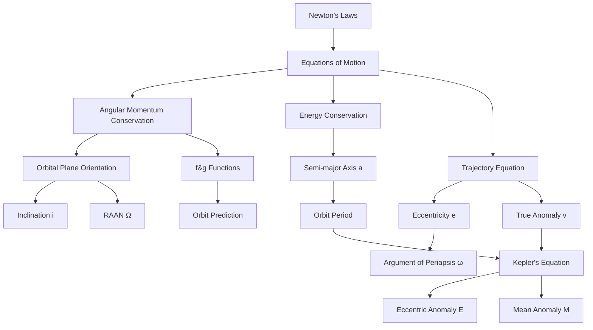
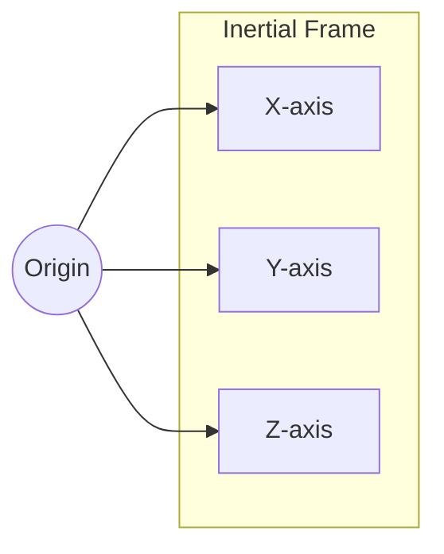
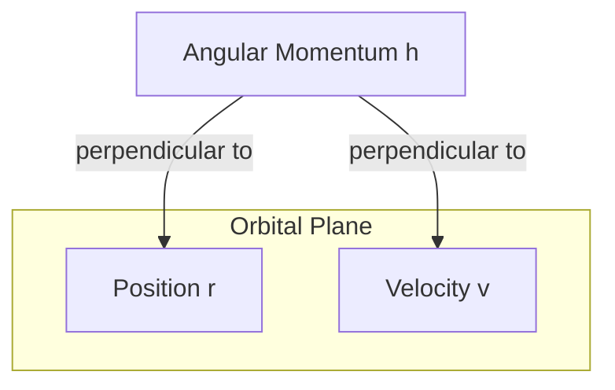

# SPCE 5025: Astronautics and Orbital Mechanics

## Overview

This course provides a rigorous foundation in astronautics, focusing on Earth-orbiting satellites. We build from Newton's laws to derive the complete mathematical framework for describing and predicting satellite motion.

### Big Picture: What We're Building

The central problem of astronautics is deceptively simple: **Given where a satellite is now, where will it be later?** Answering this requires understanding:
1. Why satellites move in ellipses (trajectory equation)
2. How to describe an orbit's shape and orientation (orbital elements)
3. How to relate position to time (Kepler's equation)

### Topic Dependencies



### Course Information
- **Instructor:** Ed Brown
- **Schedule:** Tuesdays (Lecture), Thursdays (Office Hours), 7:00 PM Mountain Time
- **Primary Text:** Vallado, *Fundamentals of Astrodynamics and Applications*, 5th Edition
- **Supplementary:** Goddard Trajectory Determination System Mathematical Theory (1989)

---

# CLASS 1: Foundations of Orbital Mechanics
*(Reference: SPCE5025_Class_1_r1.pdf)*

---

## Topic 1: Kepler's Laws — The Observational Foundation

### Analogy
Imagine you're watching cars on a racetrack from above. Johannes Kepler was like an observer who, without knowing anything about engines or physics, noticed patterns in how the "cars" (planets) moved around the track. He wrote down three rules that perfectly described what he saw, even though he couldn't explain *why* they worked.

### Core Explanation
In the early 1600s, Kepler analyzed decades of planetary observations and discovered three empirical laws—patterns that held true without any underlying theory. These laws were later *explained* by Newton's physics, but they remain useful as quick checks on our mathematical derivations.

### Formal Definitions
*(Class 1, Page 7)*

**Kepler's First Law (Law of Ellipses):**
> The orbit of a satellite is an ellipse with the central body at one focus.

**Kepler's Second Law (Law of Equal Areas):**
> The line joining the central body and satellite sweeps out equal areas in equal time.

**Kepler's Third Law (Harmonic Law):**
> The square of the satellite's orbital period is proportional to the cube of the mean distance from the central body.

Mathematically:
$$T_P^2 \propto a^3$$

### Why These Laws Matter
- **First Law:** Tells us the *shape* of orbits (ellipses, not circles)
- **Second Law:** Tells us satellites move *faster* when closer to Earth
- **Third Law:** Lets us calculate orbital period from orbit size

### Key Takeaways
1. Kepler's laws are observational facts that any valid orbital theory must reproduce
2. We will derive all three laws from Newton's physics
3. The central body is at a *focus*, not the *center*, of the ellipse

---

## Topic 2: Newton's Laws — The Physical Foundation

### Analogy
If Kepler described *what* satellites do, Newton explained *why*. Newton gave us the "rules of the game" that govern all motion—like knowing the rules of chess rather than just observing that certain pieces tend to move certain ways.

### Core Explanation
Newton's three laws of motion, combined with his law of universal gravitation, provide the complete foundation for classical orbital mechanics. Everything we derive follows from these principles.

### Formal Definitions
*(Class 1, Page 8)*

**Newton's First Law (Inertia):**
> An object in motion moves in a straight line unless acted on by an outside force.

This explains why satellites don't just fly off into space—gravity constantly pulls them toward Earth.

**Newton's Second Law (Force and Acceleration):**
$$\vec{F} = m\vec{a}$$

More precisely:
$$\vec{F} = \frac{d}{dt}(m\vec{v})$$

For constant mass, this reduces to $\vec{F} = m\vec{a}$.

**Newton's Third Law (Action-Reaction):**
> Every force has an equal and opposite reaction force.

When Earth pulls on a satellite, the satellite also pulls on Earth (though Earth barely moves due to its much larger mass).

### The Inverse Square Law of Gravitation
*(Class 1, Page 9)*

At planetary scales, gravitational force follows an inverse square relationship with distance:

$$f \propto \frac{1}{r^2}$$

The gravitational force exerted by mass $m_2$ on mass $m_1$ is:

$$f_{grav,1} = \frac{Gm_1m_2}{r^2}$$

In vector form, pointing from $m_1$ toward $m_2$:

$$\vec{f}_{grav,1} = \frac{Gm_1m_2}{r^3}\vec{r}$$

where $\vec{r}$ is the position vector from $m_1$ to $m_2$.

### Gravitational Acceleration
*(Class 1, Page 10)*

The gravitational acceleration experienced by a small mass $m$ due to a large mass $M$ separated by distance $r$:

$$a_{grav} = \frac{GM}{r^2}$$

The force on $m$:
$$f_m = ma_{grav} = \frac{GMm}{r^2}$$

As a vector (with direction toward $M$):
$$\vec{f}_m = -\frac{GMm}{r^2}\frac{\vec{r}}{r} = -\frac{GMm}{r^3}\vec{r}$$

The negative sign indicates the force points *toward* $M$ (opposite to $\vec{r}$ which points away from $M$).

### Quick Check ✓
*Why does gravitational force have an inverse square dependence on distance?*

This arises from geometry: the gravitational "influence" spreads out over the surface of a sphere, whose area is $4\pi r^2$. As distance doubles, the area quadruples, so the intensity decreases by a factor of four.

---

## Topic 3: The Two-Body Problem — Setting Up the Equations

### Analogy
Imagine two dancers connected by an invisible elastic band. Each dancer affects the other's motion, but if one dancer is much heavier (like a sumo wrestler dancing with a child), the heavy dancer barely moves while the light dancer orbits around. This is the two-body problem simplified.

### Core Explanation
Our goal is to describe how a satellite moves through space when subject only to gravitational attraction from a single central body. We'll make several simplifying assumptions that let us find an exact mathematical solution.

### The Goal
*(Class 1, Page 11)*

> Find a way to describe the motion through space of a satellite subject to an inverse square gravitational force.

**Important Note:** This derivation requires *no assumption* that the mass $m$ is "in orbit" about $M$. We're solving an idealized problem about point masses in space. "In orbit" simply means the satellite moves without hitting the ground.

### Defining the Reference Frame
*(Class 1, Page 13)*

All derivations use vector quantities measured in a **Cartesian coordinate system** with three mutually orthogonal directions ($\hat{i}$, $\hat{j}$, $\hat{k}$ or $\hat{X}$, $\hat{Y}$, $\hat{Z}$).

These characteristic directions are **fixed in space**—an **inertial reference frame**. Using non-moving coordinate axes greatly simplifies the mathematics.



### Deriving the Equations of Motion
*(Class 1, Page 14)*

**Setup:**
- Define position vectors with respect to an arbitrary origin
- Let $\vec{r}_M$ = position of central body $M$
- Let $\vec{r}_m$ = position of satellite $m$
- Let $\vec{r} = \vec{r}_m - \vec{r}_M$ = relative position vector

**Accelerations of each body:**

The satellite accelerates toward $M$:
$$\ddot{\vec{r}}_m = -\frac{GM}{r^3}\vec{r}$$

The central body accelerates toward $m$:
$$\ddot{\vec{r}}_M = \frac{Gm}{r^3}\vec{r}$$

(Positive sign because the force on $M$ points in the $+\vec{r}$ direction)

**Relative acceleration:**
$$\ddot{\vec{r}} = \ddot{\vec{r}}_m - \ddot{\vec{r}}_M$$

$$\ddot{\vec{r}} = -\frac{GM}{r^3}\vec{r} - \frac{Gm}{r^3}\vec{r}$$

$$\ddot{\vec{r}} = -\frac{G(M+m)}{r^3}\vec{r}$$

**Key Simplification:** If $M >> m$ (Earth's mass is $\sim 10^{24}$ kg, satellites are $\sim 10^3$ kg):

$$\boxed{\ddot{\vec{r}} = -\frac{GM}{r^3}\vec{r}}$$

### Significant Assumptions
*(Class 1, Page 14)*

1. $M >> m$ (satellite mass negligible compared to central body)
2. Gravitational field is smooth and spherically symmetric
3. Gravitational force emanates from a point at the center of $M$
4. No other forces act on the bodies (no drag, solar pressure, etc.)

### The Gravitational Parameter μ
*(Class 1, Page 15)*

**Definitions:**

| Quantity | Symbol | Value | Notes |
|----------|--------|-------|-------|
| Gravitational Constant | $G$ | $6.673 \times 10^{-11}$ m³/(kg·s²) | Poorly defined—hard to measure |
| Mass of Central Body | $M$ | varies | Also poorly defined for celestial bodies |
| Gravitational Parameter | $\mu = GM$ | varies | Well-defined from orbital motion |

For Earth:
$$\mu_{\oplus} = 3.986004418 \times 10^{14} \text{ m}^3/\text{s}^2 \text{ (WGS84 value)}$$

**Why use μ?** We can measure orbital motion very precisely, giving us an accurate value for the *product* $GM$, even though we can't measure $G$ or $M$ individually with high precision.

### The Fundamental Equation of Motion
*(Class 1, Page 16)*

$$\boxed{\ddot{\vec{r}} = -\frac{\mu}{r^3}\vec{r}}$$

This second-order vector differential equation requires **6 constants of integration** to fully describe the motion:
- 3 position components
- 3 velocity components

Or equivalently, 6 **orbital elements** (which we'll derive).

### Key Takeaways
1. The two-body problem assumes one mass dominates
2. The gravitational parameter $\mu = GM$ is known more precisely than $G$ or $M$ individually
3. We need 6 independent quantities to fully describe an orbit
4. The equations of motion are the starting point for all derivations

---

## Topic 4: Angular Momentum — The First Integral

### Analogy
Think of a figure skater pulling their arms in to spin faster. The product of how far the mass is from the spin axis and how fast it's rotating (angular momentum) stays constant. Similarly, a satellite's angular momentum is constant, which constrains it to move in a fixed plane.

### Core Explanation
By manipulating the equations of motion, we can show that a specific quantity—angular momentum—never changes. This "conservation law" has profound implications: it tells us the orbital plane is fixed in space and relates to Kepler's equal areas law.

### Derivation of Angular Momentum Conservation
*(Class 1, Page 17)*

**Definition of angular momentum:**
$$\vec{h} = \vec{r} \times \dot{\vec{r}}$$

**Step 1:** Take the cross product of $\vec{r}$ with the equation of motion:

$$\vec{r} \times \ddot{\vec{r}} = -\frac{\mu}{r^3}(\vec{r} \times \vec{r}) = 0$$

The cross product of any vector with itself is zero.

**Step 2:** Consider the time derivative of angular momentum:

$$\frac{d}{dt}(\vec{r} \times \dot{\vec{r}}) = \dot{\vec{r}} \times \dot{\vec{r}} + \vec{r} \times \ddot{\vec{r}}$$

The first term is zero (cross product of vector with itself).
The second term is zero (from Step 1).

**Step 3:** Therefore:
$$\frac{d}{dt}(\vec{r} \times \dot{\vec{r}}) = 0$$

**Step 4:** Integrate:
$$\vec{r} \times \dot{\vec{r}} = \vec{h} = \text{constant}$$

### Physical Interpretation
*(Class 1, Page 18)*

**What does constant angular momentum mean?**

1. **Constant direction:** The orbital plane has a fixed orientation in inertial space
   - $\vec{h}$ is perpendicular to both $\vec{r}$ and $\vec{v}$
   - Since $\vec{h}$ doesn't change direction, the plane containing $\vec{r}$ and $\vec{v}$ doesn't change

2. **Constant magnitude:** Related to Kepler's "equal areas in equal times"
   - The rate at which the satellite sweeps out area is proportional to $|\vec{h}|$



### Key Takeaways
1. Angular momentum $\vec{h} = \vec{r} \times \dot{\vec{r}}$ is conserved
2. Conservation of $\vec{h}$ means motion is confined to a plane
3. The direction of $\vec{h}$ tells us the orientation of the orbital plane
4. This gives us our first "orbital element" information

---

## Topic 5: Inclination — First Orientation Angle

### Analogy
If you tilt a coin on a table, the angle of tilt measured from the horizontal is like the inclination. For orbits, inclination measures how much the orbital plane is "tilted" relative to Earth's equator.

### Core Explanation
The inclination $i$ is the angle between the orbital plane and Earth's equatorial plane. It's one of two angles needed to fully specify the orientation of the orbital plane.

### Formal Definition and Derivation
*(Class 1, Page 19)*

The inclination is the angle between the angular momentum vector $\vec{h}$ and the $\hat{Z}$ axis (which points along Earth's rotation axis, perpendicular to the equator).

**Using the dot product:**
$$\hat{Z} \cdot \hat{h} = |\hat{Z}||\hat{h}|\cos i = \cos i$$

Since both are unit vectors:
$$\cos i = \hat{Z} \cdot \hat{h}$$

**Therefore:**
$$\boxed{i = \cos^{-1}(\hat{Z} \cdot \hat{h})}$$

**Range:** $i \in [0°, 180°]$

### Interpretation of Inclination Values

| Inclination | Orbit Type | Description |
|-------------|------------|-------------|
| $i = 0°$ | Equatorial, prograde | Orbit lies in equatorial plane, moves east |
| $0° < i < 90°$ | Prograde | Satellite has eastward motion component |
| $i = 90°$ | Polar | Orbit passes over both poles |
| $90° < i < 180°$ | Retrograde | Satellite has westward motion component |
| $i = 180°$ | Equatorial, retrograde | Orbit lies in equatorial plane, moves west |

### Worked Example 1
**Given:** $\vec{h} = (0, 0, h)$ (angular momentum points straight up along Z-axis)

**Find:** Inclination

**Solution:**
$$\hat{h} = \frac{\vec{h}}{|\vec{h}|} = (0, 0, 1)$$
$$\cos i = \hat{Z} \cdot \hat{h} = (0, 0, 1) \cdot (0, 0, 1) = 1$$
$$i = \cos^{-1}(1) = 0°$$

This is an equatorial orbit.

### Worked Example 2
**Given:** $\vec{h} = (0.5h, 0, 0.866h)$

**Find:** Inclination

**Solution:**
$$|\vec{h}| = h\sqrt{0.5^2 + 0 + 0.866^2} = h\sqrt{0.25 + 0.75} = h$$
$$\hat{h} = (0.5, 0, 0.866)$$
$$\cos i = \hat{Z} \cdot \hat{h} = 0.866$$
$$i = \cos^{-1}(0.866) = 30°$$

---

## Topic 6: Right Ascension of Ascending Node (RAAN)

### Analogy
Imagine a hula hoop tilted in space. The inclination tells you how much it's tilted, but you still need to know *which direction* it's tilted—is the high side pointing north, east, or somewhere else? The RAAN tells you the compass direction where the tilted hoop crosses the equator going upward.

### Core Explanation
The RAAN (symbol: $\Omega$) specifies where the orbital plane intersects the equatorial plane. Specifically, it measures the angle from the reference direction ($\hat{X}$, typically pointing toward the vernal equinox) to the point where the satellite crosses the equator moving from south to north.

### Formal Definition and Derivation
*(Class 1, Page 20)*

**The Ascending Node:** The point where the orbit crosses the equatorial plane moving northward (from negative to positive Z).

**The Node Vector $\hat{N}$:** Points from Earth's center toward the ascending node.

Since the ascending node lies in both the orbital plane (perpendicular to $\vec{h}$) and the equatorial plane (perpendicular to $\hat{Z}$), the node vector is perpendicular to both:

$$\hat{N} = \frac{\hat{Z} \times \hat{h}}{|\hat{Z} \times \hat{h}|}$$

**Components of $\hat{N}$:**
$$\hat{N} = (N_x, N_y, 0)$$

(The Z-component is zero because $\hat{N}$ lies in the equatorial plane)

**Computing RAAN:**
$$\boxed{\Omega = \text{atan2}(N_y, N_x)}$$

**Range:** $\Omega \in [0°, 360°]$

### The ATAN2 Function
*(Class 1, Page 21)*

**Why not just use arctan?**

The standard arctangent function returns values only in the range $(-90°, 90°)$, which doesn't account for which quadrant the angle is in.

The **atan2** function takes two arguments (y, x) and returns the angle in the correct quadrant:

| Quadrant | sin | cos | atan2 returns |
|----------|-----|-----|---------------|
| I | + | + | $[0°, 90°]$ |
| II | + | - | $(90°, 180°]$ |
| III | - | - | $(-180°, -90°)$ |
| IV | - | + | $[-90°, 0°)$ |

**Converting to $[0°, 360°]$:** If atan2 returns a negative angle, add $360°$ (or $2\pi$ radians).

### Worked Example
**Given:** $\vec{h} = (-0.5h, 0.5h, 0.707h)$

**Find:** RAAN ($\Omega$)

**Step 1:** Compute $\hat{Z} \times \hat{h}$

$$\hat{h} = \frac{1}{h}(-0.5h, 0.5h, 0.707h) = (-0.5, 0.5, 0.707)$$

$$\hat{Z} \times \hat{h} = \begin{vmatrix} \hat{i} & \hat{j} & \hat{k} \\ 0 & 0 & 1 \\ -0.5 & 0.5 & 0.707 \end{vmatrix}$$

$$= \hat{i}(0 \cdot 0.707 - 1 \cdot 0.5) - \hat{j}(0 \cdot 0.707 - 1 \cdot (-0.5)) + \hat{k}(0 \cdot 0.5 - 0 \cdot (-0.5))$$

$$= (-0.5, -0.5, 0)$$

**Step 2:** Normalize

$$|\hat{Z} \times \hat{h}| = \sqrt{0.25 + 0.25} = 0.707$$

$$\hat{N} = \frac{(-0.5, -0.5, 0)}{0.707} = (-0.707, -0.707, 0)$$

**Step 3:** Compute RAAN

$$\Omega = \text{atan2}(-0.707, -0.707) = -135° + 360° = 225°$$

---

## Topic 7: Energy Conservation — The Second Integral

### Analogy
A roller coaster at the top of a hill has lots of potential energy (height) but is moving slowly (low kinetic energy). At the bottom, it's moving fast (high kinetic energy) but has less potential energy. The total energy stays the same. Satellites work the same way—they move faster when closer to Earth.

### Core Explanation
By manipulating the equations of motion differently, we can show that another quantity—total mechanical energy—is conserved. This links the satellite's speed to its distance from Earth at any point in the orbit.

### Derivation of Energy Conservation
*(Class 1, Pages 22-25)*

**Step 1:** Rearrange the equation of motion:
$$\ddot{\vec{r}} + \frac{\mu}{r^3}\vec{r} = 0$$

**Step 2:** Take the dot product with $\dot{\vec{r}}$:
$$\dot{\vec{r}} \cdot \ddot{\vec{r}} + \frac{\mu}{r^3}\dot{\vec{r}} \cdot \vec{r} = 0$$

**Step 3:** Interpret as scalars.

For the first term, we need to understand the relationship between vectors and their magnitudes:
$$\dot{\vec{r}} \cdot \ddot{\vec{r}} = \vec{v} \cdot \dot{\vec{v}}$$

where $\vec{v} = \dot{\vec{r}}$ is velocity and $\dot{\vec{v}}$ is acceleration.

**Key insight:** *(Class 1, Page 23)*
$$\vec{r} \cdot \dot{\vec{r}} = r \cdot v \cdot \cos\gamma = r \cdot \dot{r}$$

where $\gamma$ is the angle between $\vec{r}$ and $\vec{v}$, and $\dot{r}$ is the rate of change of the *magnitude* of $\vec{r}$ (not the vector!).

Similarly:
$$\dot{\vec{r}} \cdot \ddot{\vec{r}} = v \cdot \dot{v}$$

**⚠️ Critical Note:** $\dot{r} \neq |\dot{\vec{r}}|$. The scalar $\dot{r}$ is the rate of change of distance from the center, while $|\dot{\vec{r}}|$ is the speed.

**Step 4:** The equation becomes:
$$v\dot{v} + \frac{\mu}{r^3}r\dot{r} = v\dot{v} + \frac{\mu}{r^2}\dot{r} = 0$$

**Step 5:** Recognize these as time derivatives:
$$\frac{d}{dt}\left(\frac{v^2}{2}\right) = \frac{2v\dot{v}}{2} = v\dot{v}$$

$$\frac{d}{dt}\left(-\frac{\mu}{r}\right) = \frac{\mu}{r^2}\dot{r}$$

**Step 6:** Combine:
$$\frac{d}{dt}\left(\frac{v^2}{2} - \frac{\mu}{r}\right) = 0$$

**Step 7:** Integrate:
$$\boxed{\frac{v^2}{2} - \frac{\mu}{r} = \xi = \text{constant}}$$

where:
- $\frac{v^2}{2}$ is **specific kinetic energy** (kinetic energy per unit mass)
- $-\frac{\mu}{r}$ is **specific potential energy**
- $\xi$ is **specific mechanical energy** (total energy per unit mass)

### The Potential Energy Convention
*(Class 1, Page 25)*

We chose to define potential energy such that:
$$PE \to 0 \text{ as } r \to \infty$$

This means:
- **Bound orbits (ellipses):** $\xi < 0$ (negative total energy)
- **Escape trajectory (parabola):** $\xi = 0$
- **Hyperbolic trajectory:** $\xi > 0$ (positive total energy)

The negative energy for elliptical orbits is not "negative energy"—it's just a consequence of our choice of zero point.

### Key Takeaways
1. Total specific energy $\xi = \frac{v^2}{2} - \frac{\mu}{r}$ is conserved
2. Satellites move faster when closer to the central body
3. Bound (elliptical) orbits have negative total energy
4. Energy conservation provides our second "integral" of the equations of motion

---

## Topic 8: The Trajectory Equation — Shape of the Orbit

### Analogy
If you throw a ball, it follows a parabolic path. If Earth's gravity could grab it and keep it coming back, the path would close into an ellipse. The trajectory equation tells us *exactly* what shape that closed path has.

### Core Explanation
This is the most important derivation in basic orbital mechanics. We show that the solution to the two-body problem is a conic section (ellipse, parabola, or hyperbola), with the central body at one focus. This proves Kepler's First Law from Newton's physics.

### Complete Derivation
*(Class 1, Pages 26-32)*

**Step 1:** Start with the equation of motion:
$$\ddot{\vec{r}} = -\frac{\mu}{r^3}\vec{r}$$

**Step 2:** Cross multiply (post-multiply) by $\vec{h}$:
$$\ddot{\vec{r}} \times \vec{h} = -\frac{\mu}{r^3}\vec{r} \times \vec{h}$$

**Step 3:** Use the identity $\vec{r} \times \vec{h} = -\vec{h} \times \vec{r} = -(\vec{r} \times \dot{\vec{r}}) \times \vec{r}$

**Step 4:** Apply the vector triple product identity:
$$\vec{a} \times (\vec{b} \times \vec{c}) = (\vec{a} \cdot \vec{c})\vec{b} - (\vec{a} \cdot \vec{b})\vec{c}$$

**Step 5:** Evaluate the left-hand side:
$$\ddot{\vec{r}} \times \vec{h} = \frac{d}{dt}(\dot{\vec{r}} \times \vec{h}) = \frac{d}{dt}(\dot{\vec{r}} \times \vec{h}) - \dot{\vec{r}} \times \frac{d\vec{h}}{dt}$$

Since $\vec{h}$ is constant, $\frac{d\vec{h}}{dt} = 0$:
$$\ddot{\vec{r}} \times \vec{h} = \frac{d}{dt}(\dot{\vec{r}} \times \vec{h})$$

**Step 6:** Evaluate the right-hand side using the triple product:
$$\vec{r} \times (\dot{\vec{r}} \times \vec{r}) = (\vec{r} \cdot \vec{r})\dot{\vec{r}} - (\dot{\vec{r}} \cdot \vec{r})\vec{r} = r^2\dot{\vec{r}} - r\dot{r}\vec{r}$$

So:
$$\frac{\mu}{r^3}[\vec{r} \times (\dot{\vec{r}} \times \vec{r})] = \frac{\mu}{r^3}(r^2\dot{\vec{r}} - r\dot{r}\vec{r}) = \mu\left(\frac{\dot{\vec{r}}}{r} - \frac{\dot{r}}{r^2}\vec{r}\right)$$

**Step 7:** Recognize this as a time derivative:
$$\frac{d}{dt}\left(\frac{\vec{r}}{r}\right) = \frac{\dot{\vec{r}}}{r} - \frac{\dot{r}}{r^2}\vec{r}$$

**Step 8:** Therefore:
$$\frac{d}{dt}(\dot{\vec{r}} \times \vec{h}) = \mu\frac{d}{dt}\left(\frac{\vec{r}}{r}\right)$$

**Step 9:** Integrate:
$$\dot{\vec{r}} \times \vec{h} = \mu\frac{\vec{r}}{r} + \vec{B}$$

where $\vec{B}$ is a constant vector of integration.

**Step 10:** Dot multiply by $\vec{r}$:
$$\vec{r} \cdot (\dot{\vec{r}} \times \vec{h}) = \mu\frac{\vec{r} \cdot \vec{r}}{r} + \vec{r} \cdot \vec{B}$$

**Step 11:** Use the identity $\vec{a} \cdot (\vec{b} \times \vec{c}) = (\vec{a} \times \vec{b}) \cdot \vec{c}$:
$$(\vec{r} \times \dot{\vec{r}}) \cdot \vec{h} = \vec{h} \cdot \vec{h} = h^2$$

**Step 12:** Define $\nu$ as the angle between $\vec{r}$ and $\vec{B}$:
$$\vec{r} \cdot \vec{B} = rB\cos\nu$$

**Step 13:** Combine:
$$h^2 = \mu r + rB\cos\nu$$

**Step 14:** Solve for $r$:
$$h^2 = r(\mu + B\cos\nu)$$

$$r = \frac{h^2/\mu}{1 + \frac{B}{\mu}\cos\nu}$$

### The Trajectory Equation
*(Class 1, Page 31)*

$$\boxed{r = \frac{h^2/\mu}{1 + \frac{B}{\mu}\cos\nu}}$$

This has the mathematical form of the **polar equation of a conic section** relative to a focus:

$$r = \frac{a(1-e^2)}{1 + e\cos\nu}$$

where:
- $a$ = semi-major axis
- $e$ = eccentricity
- $\nu$ = true anomaly (angle from periapsis)

### Matching Terms
*(Class 1, Page 32)*

Comparing the two forms:
$$\frac{h^2}{\mu} = p = a(1-e^2)$$

where $p$ is called the **semi-latus rectum**.

$$e = \frac{B}{\mu}$$

### The Eccentricity Vector
*(Class 1, Page 35)*

The vector $\vec{B}$ points toward periapsis (closest approach). The **eccentricity vector** is:

$$\vec{e} = \frac{\vec{B}}{\mu}$$

From the derivation:
$$\vec{B} = \dot{\vec{r}} \times \vec{h} - \mu\frac{\vec{r}}{r}$$

Therefore:
$$\mu\vec{e} = \dot{\vec{r}} \times \vec{h} - \mu\frac{\vec{r}}{r}$$

Using the triple product identity:
$$\boxed{\mu\vec{e} = \left(v^2 - \frac{\mu}{r}\right)\vec{r} - (\dot{\vec{r}} \cdot \vec{r})\dot{\vec{r}}}$$

This allows us to compute both the magnitude and direction of eccentricity from position and velocity.

### Key Takeaways
1. The trajectory equation proves orbits are conic sections (Kepler's First Law)
2. The eccentricity vector points toward periapsis
3. The semi-latus rectum $p = h^2/\mu = a(1-e^2)$
4. True anomaly $\nu$ is measured from periapsis

---

## Topic 9: Relating Energy to Semi-Major Axis

### Analogy
Think of orbital energy like a bank account. The more energy you have (less negative for bound orbits), the "bigger" your orbit can be. The semi-major axis is like the orbit's credit limit—determined entirely by the account balance.

### Derivation
*(Class 1, Pages 36-38)*

**Step 1:** At periapsis and apoapsis, velocity is perpendicular to position:
$$h = r_p v_p = r_a v_a$$

**Step 2:** From the trajectory equation at these points:
$$r_p = \frac{a(1-e^2)}{1 + e\cos(0°)} = \frac{a(1-e^2)}{1+e} = a(1-e)$$

$$r_a = \frac{a(1-e^2)}{1 + e\cos(180°)} = \frac{a(1-e^2)}{1-e} = a(1+e)$$

**Step 3:** Apply energy conservation at perigee:
$$\xi = \frac{v_p^2}{2} - \frac{\mu}{r_p}$$

**Step 4:** Since $h = r_p v_p$, we have $v_p = h/r_p$:
$$\xi = \frac{h^2}{2r_p^2} - \frac{\mu}{r_p}$$

**Step 5:** Substitute $h^2 = \mu a(1-e^2)$ and $r_p = a(1-e)$:
$$\xi = \frac{\mu a(1-e^2)}{2a^2(1-e)^2} - \frac{\mu}{a(1-e)}$$

**Step 6:** Simplify:
$$\xi = \frac{\mu(1-e)(1+e)}{2a(1-e)^2} - \frac{\mu}{a(1-e)}$$

$$\xi = \frac{\mu(1+e)}{2a(1-e)} - \frac{\mu}{a(1-e)}$$

$$\xi = \frac{\mu}{a(1-e)}\left(\frac{1+e}{2} - 1\right)$$

$$\xi = \frac{\mu}{a(1-e)}\left(\frac{1+e-2}{2}\right) = \frac{\mu}{a(1-e)}\left(\frac{e-1}{2}\right)$$

$$\xi = -\frac{\mu(1-e)}{2a(1-e)} = -\frac{\mu}{2a}$$

### Energy-Semi-major Axis Relationship
$$\boxed{\xi = -\frac{\mu}{2a}}$$

or equivalently:

$$\boxed{a = -\frac{\mu}{2\xi}}$$

**Important implications:**
- Energy depends *only* on semi-major axis, not eccentricity
- Two orbits with the same $a$ have the same energy, regardless of shape
- For ellipses ($\xi < 0$), $a > 0$

### Eccentricity from Energy and Angular Momentum
*(Class 1, Page 38)*

Starting from $a(1-e^2) = h^2/\mu$ and $a = -\mu/(2\xi)$:

$$-\frac{\mu}{2\xi}(1-e^2) = \frac{h^2}{\mu}$$

$$1-e^2 = -\frac{2h^2\xi}{\mu^2}$$

$$e^2 = 1 + \frac{2h^2\xi}{\mu^2}$$

$$\boxed{e = \sqrt{1 + \frac{2h^2\xi}{\mu^2}}}$$

(for $0 \leq e < 1$ for ellipses)

---

## Topic 10: Properties of the Ellipse

### Geometric Definitions
*(Class 1, Page 39)*

```
       b
    ┌──────┐
    │      │ Semi-minor axis
    │  ┌───┼───┐
    │  │   │   │
────┼──●───┼───○──────
    │  │   │   │
    │  └───┼───┘
    │      │
    └──────┘
       a (Semi-major axis)
    
    ● = Focus (central body here)
    ○ = Empty focus
```

| Quantity | Symbol | Formula |
|----------|--------|---------|
| Semi-major axis | $a$ | $\frac{r_a + r_p}{2}$ |
| Semi-minor axis | $b$ | $a\sqrt{1-e^2} = \sqrt{ap}$ |
| Eccentricity | $e$ | $\frac{c}{a} = \frac{r_a - r_p}{r_a + r_p}$ |
| Focal distance | $c$ | $ae$ |
| Semi-latus rectum | $p$ | $a(1-e^2) = \frac{h^2}{\mu}$ |
| Periapsis radius | $r_p$ | $a(1-e)$ |
| Apoapsis radius | $r_a$ | $a(1+e)$ |

**Defining property of ellipse:** For any point on the ellipse, $r_1 + r_2 = 2a$, where $r_1$ and $r_2$ are distances to the two foci.

---

## Topic 11: Orbit Period

### Derivation
*(Class 1, Pages 40-44)*

**Step 1:** Kepler's Second Law states that satellites sweep equal areas in equal times.

**Step 2:** From angular momentum:
$$h = rv\cos\phi = r^2\dot{\nu}$$

where $\phi$ is the flight path angle and $\dot{\nu}$ is the rate of change of true anomaly.

**Step 3:** Area swept in time $dt$:
$$dA = \frac{1}{2}r^2 d\nu$$

**Step 4:** Therefore:
$$\frac{dA}{dt} = \frac{1}{2}r^2\dot{\nu} = \frac{h}{2}$$

**Step 5:** Time to sweep area $A$:
$$dt = \frac{2}{h}dA$$

**Step 6:** Orbit period = time to sweep the entire ellipse:
$$T_P = \int dt = \frac{2}{h}\int dA = \frac{2}{h}(\pi ab)$$

$$T_P = \frac{2\pi ab}{h}$$

**Step 7:** Substitute $b = \sqrt{ap}$ and $p = h^2/\mu$:
$$b = \sqrt{a \cdot \frac{h^2}{\mu}} = \frac{h\sqrt{a}}{\sqrt{\mu}}$$

$$T_P = \frac{2\pi a}{h} \cdot \frac{h\sqrt{a}}{\sqrt{\mu}} = 2\pi\sqrt{\frac{a^3}{\mu}}$$

### Orbit Period Formula
$$\boxed{T_P = 2\pi\sqrt{\frac{a^3}{\mu}}}$$

This is **Kepler's Third Law** derived from Newton's physics!

### Worked Example
**Given:** A satellite in orbit around Earth with $a = 7000$ km

**Find:** Orbital period

**Solution:**
$$T_P = 2\pi\sqrt{\frac{(7 \times 10^6)^3}{3.986 \times 10^{14}}}$$

$$T_P = 2\pi\sqrt{\frac{3.43 \times 10^{20}}{3.986 \times 10^{14}}}$$

$$T_P = 2\pi\sqrt{8.605 \times 10^5} = 2\pi \times 927.6 = 5829 \text{ s} \approx 97.2 \text{ min}$$

---

## Topic 12: Argument of Periapsis

### Core Explanation
*(Class 1, Pages 33-34)*

The argument of periapsis ($\omega_p$) specifies the orientation of the ellipse *within* the orbital plane. It's the angle measured in the orbital plane from the ascending node to periapsis.

### Computation
The eccentricity vector $\hat{B}$ (or $\hat{e}$) points toward periapsis. The argument of periapsis is the angle between the ascending node $\hat{N}$ and $\hat{B}$:

**From dot product:**
$$\hat{N} \cdot \hat{B} = \cos\omega_p$$

**From cross product (for sign determination):**
$$|\hat{N} \times \hat{B}| = \sin\omega_p$$

The direction of $\hat{N} \times \hat{B}$ is either parallel or anti-parallel to $\hat{h}$.

**Complete formula:**
$$\boxed{\omega_p = \text{atan2}(\hat{h} \cdot (\hat{N} \times \hat{B}), \hat{N} \cdot \hat{B})}$$

**Range:** $\omega_p \in [0°, 360°]$

---

## Topic 13: True Anomaly

### Core Explanation
*(Class 1, Pages 45-47)*

The true anomaly $\nu$ is the angle from periapsis to the satellite's current position, measured in the orbital plane.

### Computation from Position
From the trajectory equation derivation:
$$\cos\nu = \frac{\vec{r} \cdot \vec{B}}{rB}$$

**Quadrant ambiguity:** The inverse cosine only gives angles in $[0°, 180°]$.

**Resolution:** *(Class 1, Page 47)*
- If $\vec{r} \cdot \vec{v} < 0$, the satellite is moving toward periapsis, so $\nu \in (180°, 360°)$
- Use: $\nu = 360° - \cos^{-1}\left(\frac{\vec{r} \cdot \vec{e}}{re}\right)$ if $\vec{r} \cdot \vec{v} < 0$

---

## Topic 14: Summary of Classical Orbital Elements

*(Class 1, Page 45)*

| Element | Symbol | Description | Range | Formula |
|---------|--------|-------------|-------|---------|
| Semi-major axis | $a$ | Size of orbit | $(0, \infty)$ | $a = -\frac{\mu}{2\xi}$ |
| Eccentricity | $e$ | Shape of orbit | $[0, 1)$ | $e = \sqrt{1 + \frac{2h^2\xi}{\mu^2}}$ |
| Inclination | $i$ | Tilt from equator | $[0°, 180°]$ | $i = \cos^{-1}(\hat{Z} \cdot \hat{h})$ |
| RAAN | $\Omega$ | Rotation of orbital plane | $[0°, 360°]$ | $\Omega = \text{atan2}(N_y, N_x)$ |
| Argument of periapsis | $\omega_p$ | Orientation within plane | $[0°, 360°]$ | $\omega_p = \text{atan2}(\hat{h}\cdot(\hat{N}\times\hat{B}), \hat{N}\cdot\hat{B})$ |
| True anomaly | $\nu$ | Position on orbit | $[0°, 360°]$ | See above |

**Additional useful formulas:**
$$\vec{h} = \vec{r} \times \dot{\vec{r}} = \text{constant}$$

$$p = \frac{h^2}{\mu} = a(1-e^2)$$

$$\hat{N} = \frac{\hat{Z} \times \hat{h}}{|\hat{Z} \times \hat{h}|}$$

$$\vec{B} = \dot{\vec{r}} \times \vec{h} - \mu\frac{\vec{r}}{r}$$

$$T_P = 2\pi\sqrt{\frac{a^3}{\mu}}$$

---

## Practice Problems — Class 1

### Problem 1: Basic Element Calculation
**Given:** 
- Position: $\vec{r} = (6678, 0, 0)$ km
- Velocity: $\vec{v} = (0, 7.73, 0)$ km/s
- $\mu = 3.986 \times 10^5$ km³/s²

**Find:** All six classical orbital elements

**Solution:**

**Step 1: Angular momentum**
$$\vec{h} = \vec{r} \times \vec{v} = \begin{vmatrix} \hat{i} & \hat{j} & \hat{k} \\ 6678 & 0 & 0 \\ 0 & 7.73 & 0 \end{vmatrix} = (0, 0, 51600)$$ km²/s

$h = 51600$ km²/s

**Step 2: Energy**
$$\xi = \frac{v^2}{2} - \frac{\mu}{r} = \frac{7.73^2}{2} - \frac{398600}{6678} = 29.87 - 59.69 = -29.82$$ km²/s²

**Step 3: Semi-major axis**
$$a = -\frac{\mu}{2\xi} = -\frac{398600}{2(-29.82)} = 6682$$ km

**Step 4: Eccentricity**
$$p = \frac{h^2}{\mu} = \frac{51600^2}{398600} = 6678$$ km

$$e = \sqrt{1 - \frac{p}{a}} = \sqrt{1 - \frac{6678}{6682}} = 0.024$$

**Step 5: Inclination**
$$\hat{h} = (0, 0, 1)$$
$$\cos i = \hat{Z} \cdot \hat{h} = 1$$
$$i = 0°$$ (equatorial orbit)

**Step 6: RAAN**
For equatorial orbits, RAAN is undefined (or conventionally 0°).

**Step 7: Argument of periapsis**
For equatorial orbits, $\omega_p$ is typically measured from $\hat{X}$.

**Step 8: True anomaly**
Position is along $+X$, which is where periapsis would be for this orbit.
$\nu = 0°$ (at periapsis)

**Answer:** $a = 6682$ km, $e = 0.024$, $i = 0°$, $\Omega = 0°$ (undefined), $\omega_p = 0°$, $\nu = 0°$

### Problem 2: Orbit Period
**Given:** Geostationary orbit (period = 24 hours)

**Find:** Semi-major axis

**Solution:**
$$T_P = 2\pi\sqrt{\frac{a^3}{\mu}}$$

$$a^3 = \frac{\mu T_P^2}{4\pi^2}$$

$$a^3 = \frac{3.986 \times 10^{14} \times (86400)^2}{4\pi^2} = 7.54 \times 10^{22}$$ m³

$$a = 4.22 \times 10^7$$ m $= 42,200$ km

---

