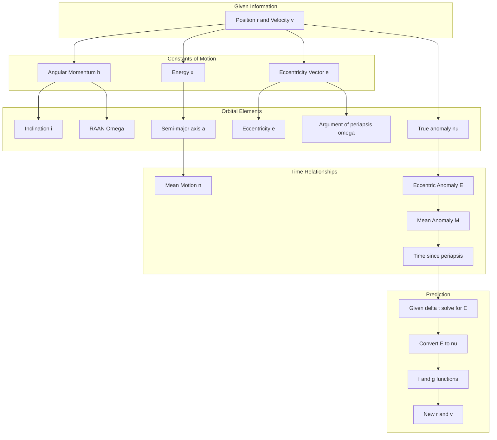

# CLASS 2: Time and Prediction
*(Reference: SPCE5025_Class_2.pdf)*

---

## Topic 15: Motivation — Why We Need Kepler's Equation

### The Problem
*(Class 2, Pages 3-5)*

We know:
- Satellites move on ellipses (trajectory equation)
- The orbital elements describe the orbit completely
- True anomaly $\nu$ tells us *where* on the orbit

But **true anomaly changes with time** as the satellite moves!

**Key insight:** Angular momentum is constant, but velocity is not. Therefore, the angular rate $\dot{\nu}$ is not constant:

$$h = r^2\dot{\nu} = \text{constant}$$

When $r$ is small (near periapsis), $\dot{\nu}$ is large (satellite moves fast).
When $r$ is large (near apoapsis), $\dot{\nu}$ is small (satellite moves slow).

### The Questions
1. Given current position and time, where will the satellite be after time $\Delta t$?
2. How long does it take to travel from one true anomaly to another?

These are related but distinct problems. Neither has a simple closed-form solution.

---

## Topic 16: The Auxiliary Circle and Eccentric Anomaly

### Analogy
Imagine projecting an elliptical orbit onto a circular screen. The eccentric anomaly is the angle measured on this "auxiliary circle." It's easier to work with because circles have uniform geometry.

### The Auxiliary Circle Construction
*(Class 2, Pages 8-11)*

```
        Auxiliary Circle (radius a)
              ╭────────╮
             ╱    B'    ╲    ← Point on circle
            │      ╱     │
            │     ╱      │
    ────────●────╳───────●────────
            │   ╱ ╲      │
            │  ╱   B     │   ← Point on ellipse
             ╲╱          ╱
              ╰────────╯
            C    O    P
            
    O = center of ellipse
    C = focus (central body)
    P = periapsis
    E = eccentric anomaly (angle at O from P to B')
    ν = true anomaly (angle at C from P to B)
```

**Key relationships:**
- The auxiliary circle has radius $a$ (semi-major axis)
- Point B is on the ellipse at true anomaly $\nu$
- Point B' is directly above/below B on the circle
- Eccentric anomaly $E$ is the angle measured at the ellipse center

### Geometric Relationships
*(Class 2, Page 9)*

For a circle:

$$\frac{x^2}{a^2} + \frac{y^2}{a^2} = 1 \Rightarrow y_{circle} = \sqrt{a^2 - x^2}$$

For an ellipse:

$$\frac{x^2}{a^2} + \frac{y^2}{b^2} = 1 \Rightarrow y_{ellipse} = \frac{b}{a}\sqrt{a^2 - x^2}$$

Therefore:

$$y_{ellipse} = \frac{b}{a}y_{circle}$$

Any vertical distance on the ellipse is scaled by $b/a$ relative to the circle.

---

## Topic 17: Kepler's Equation — Derivation

### Goal
Relate eccentric anomaly $E$ to time elapsed from periapsis.

### Area Calculation
*(Class 2, Pages 10-13)*

**Step 1:** The area swept by the satellite from periapsis to position B is $A_1$.

**Step 2:** On the auxiliary circle, define:
- Area of circular sector $OPB' = \frac{a^2 E}{2}$ (where $E$ is in radians!)
- Triangle $OCB'$ has area $= \frac{1}{2}(a\sin E)(a\cos E) = \frac{a^2}{2}\sin E \cos E$
- Area $PCB' = \frac{a^2 E}{2} - \frac{a^2}{2}\sin E \cos E$

**Step 3:** The triangle from focus C to B has:
- Base: $CF = ae - a\cos E$ (focus to foot of perpendicular)
- Height: $CB = b\sin E$ (scaled from circle)
- Area: $A_2 = \frac{1}{2}(ae - a\cos E)(b\sin E) = \frac{ab}{2}(e\sin E - \sin E \cos E)$

**Step 4:** Scale the circle area by $b/a$:

$$A_{PCB} = \frac{b}{a}\left(\frac{a^2 E}{2} - \frac{a^2}{2}\sin E \cos E\right) = \frac{ab E}{2} - \frac{ab}{2}\sin E \cos E$$

**Step 5:** The elliptical sector area is:

$$A_1 = A_{PCB} - A_2$$

$$A_1 = \frac{ab E}{2} - \frac{ab}{2}\sin E \cos E - \frac{ab}{2}(e\sin E - \sin E \cos E)$$

$$A_1 = \frac{ab E}{2} - \frac{ab}{2}e\sin E$$

$$\boxed{A_1 = \frac{ab}{2}(E - e\sin E)}$$

### Relating Area to Time
*(Class 2, Page 14)*

From Kepler's Second Law:

$$\frac{\Delta t}{A_1} = \frac{T_P}{\pi ab}$$

Substituting our area formula:

$$\frac{\Delta t}{\frac{ab}{2}(E - e\sin E)} = \frac{T_P}{\pi ab}$$

$$\Delta t = \frac{T_P}{2\pi}(E - e\sin E)$$

Using $T_P = 2\pi\sqrt{a^3/\mu}$:

$$\Delta t = \sqrt{\frac{a^3}{\mu}}(E - e\sin E)$$

### Mean Motion and Mean Anomaly
*(Class 2, Page 15)*

Define the **mean motion**:

$$n = \sqrt{\frac{\mu}{a^3}} = \frac{2\pi}{T_P}$$

Define the **mean anomaly**:

$$M = E - e\sin E$$

### Kepler's Equation

$$\boxed{M = E - e\sin E}$$

$$\boxed{n(t - T) = M}$$

where $T$ is the time of periapsis passage.

**Physical interpretation:** Mean anomaly $M$ is the angle that would be swept by a satellite moving at constant angular rate $n$ in time $(t-T)$.

---

## Topic 18: Relating Eccentric and True Anomaly

### Derivation
*(Class 2, Pages 18-19)*

**For cosine:**
From the auxiliary circle geometry:

$$a\cos E = ae + r\cos\nu$$

where $ae$ is the distance from ellipse center to focus.

Solving:

$$\cos E = e + \frac{r\cos\nu}{a}$$

Using the ellipse equation $r = \frac{a(1-e^2)}{1 + e\cos\nu}$:

$$\cos E = e + \frac{a(1-e^2)\cos\nu}{a(1 + e\cos\nu)} = e + \frac{(1-e^2)\cos\nu}{1 + e\cos\nu}$$

$$\cos E = \frac{e(1 + e\cos\nu) + (1-e^2)\cos\nu}{1 + e\cos\nu}$$

$$\cos E = \frac{e + e^2\cos\nu + \cos\nu - e^2\cos\nu}{1 + e\cos\nu}$$

$$\boxed{\cos E = \frac{e + \cos\nu}{1 + e\cos\nu}}$$

**For sine:**
From $b\sin E = r\sin\nu$ and $b = a\sqrt{1-e^2}$:

$$\boxed{\sin E = \frac{\sin\nu\sqrt{1-e^2}}{1 + e\cos\nu}}$$

**Inverse relationships:**

$$\cos\nu = \frac{e - \cos E}{e\cos E - 1} = \frac{\cos E - e}{1 - e\cos E}$$

$$\sin\nu = \frac{\sin E\sqrt{1-e^2}}{1 - e\cos E}$$

**Using atan2:**

$$E = \text{atan2}(\sin E, \cos E)$$

$$\nu = \text{atan2}(\sin\nu, \cos\nu)$$

### Direct Computation from Vectors
*(Class 2, Page 20)*

Eccentric anomaly can be computed directly from $\vec{r}$ and $\vec{v}$:

$$N_E = \frac{\vec{r} \cdot \vec{v}}{\sqrt{\mu a}}$$

$$D_E = 1 - \frac{r}{a}$$

$$E = \text{atan2}(N_E, D_E)$$

---

## Topic 19: Solving Kepler's Equation — Newton-Raphson Iteration

### The Problem
Given mean anomaly $M$, find eccentric anomaly $E$ from:

$$M = E - e\sin E$$

This is a **transcendental equation**—no closed-form solution exists!

### Newton-Raphson Method
*(Class 2, Pages 21-22)*

The general Newton-Raphson iteration formula:

$$x_{n+1} = x_n - \frac{f(x)}{f'(x)}$$

**For Kepler's equation:**

Define: $f(E) = M - E + e\sin E$

We want $f(E) = 0$.

Derivative: $f'(E) = -1 + e\cos E$

**Iteration formula:**

$$\boxed{E_{k+1} = E_k + \frac{M - E_k + e\sin E_k}{1 - e\cos E_k}}$$

**Starting value:** $E_0 = M$ usually works well.

**Convergence criterion:** Continue until $|E_{k+1} - E_k| < \text{tolerance}$

### Worked Example
**Given:** $e = 0.5$, $M = 1.0$ radian

**Find:** Eccentric anomaly $E$

**Iteration 1:**

$$E_0 = 1.0$$

$$E_1 = 1.0 + \frac{1.0 - 1.0 + 0.5\sin(1.0)}{1 - 0.5\cos(1.0)} = 1.0 + \frac{0.4207}{0.7298} = 1.577$$

**Iteration 2:**

$$E_2 = 1.577 + \frac{1.0 - 1.577 + 0.5\sin(1.577)}{1 - 0.5\cos(1.577)} = 1.577 + \frac{-0.0769}{0.9998} = 1.500$$

**Iteration 3:**

$$E_3 = 1.500 + \frac{1.0 - 1.500 + 0.5\sin(1.500)}{1 - 0.5\cos(1.500)} = 1.500 + \frac{-0.0013}{0.9646} = 1.499$$

**Converged:** $E \approx 1.499$ radians

### Alternative: Biondini's Method
*(Class 2, Page 23)*

Rewrite Kepler's equation as:

$$E = M + e\sin E$$

Take sine of both sides:

$$\sin E = \sin(M + e\sin E)$$

Let $x = \sin E$:

$$x_{i+1} = \sin(M + ex_i)$$

Iterate until convergence, then:

$$E = \sin^{-1}(x_{final})$$

---

## Topic 20: General Time of Flight

### From Arbitrary Starting Point
*(Class 2, Pages 16-17, 24)*

The general time-of-flight equation from $E_0$ to $E$ with $k$ periapsis crossings:

$$t - t_0 = k \cdot T_P + \frac{1}{n}\left[(E - e\sin E) - (E_0 - e\sin E_0)\right]$$

$$t - t_0 = k \cdot T_P + \frac{1}{n}(M - M_0)$$

### Iteration for General Case
*(Class 2, Pages 24-26)*

**Function to solve:**

$$f(E_k) = n\Delta t + M_0 - E_k + e\sin E_k$$

where $M_0 = E_0 - e\sin E_0$ is the initial mean anomaly (fixed).

**Iteration formula:**

$$E_{k+1} = E_k + \frac{n\Delta t + M_0 - E_k + e\sin E_k}{1 - e\cos E_k}$$

**Notes:**
- If $E > 2\pi$, there were periapsis crossings: $k = \text{floor}((E - E_0)/(2\pi))$
- Take $\text{mod}(E, 2\pi)$ to get $E$ in $[0, 2\pi]$

---

## Topic 21: The f and g Functions — Analytical Orbit Prediction

### Motivation
*(Class 2, Pages 28-29, 42)*

Since orbital elements are constant, position and velocity at any time can be expressed as linear combinations of initial position and velocity:

$$\vec{r} = f\vec{r}_0 + g\dot{\vec{r}}_0$$

$$\dot{\vec{r}} = \dot{f}\vec{r}_0 + \dot{g}\dot{\vec{r}}_0$$

where $f$, $g$, $\dot{f}$, $\dot{g}$ are scalar functions that depend on the change in true anomaly $\Delta\nu$.

### The Perifocal Frame
*(Class 2, Page 29)*

Work in the orbital plane with coordinates:
- $\hat{P}$ pointing toward periapsis
- $\hat{Q}$ perpendicular to $\hat{P}$ in the direction of motion
- $\hat{W}$ normal to orbital plane (parallel to $\vec{h}$)

Position and velocity:

$$\vec{r} = x\hat{P} + y\hat{Q} + 0\hat{W}$$

$$\dot{\vec{r}} = \dot{x}\hat{P} + \dot{y}\hat{Q} + 0\hat{W}$$

where $\hat{P}$, $\hat{Q}$, $\hat{W}$ are fixed (inertial).

### Derivation of f and g
*(Class 2, Pages 30-32)*

**Finding f:** Cross $\vec{r}$ with $\dot{\vec{r}}_0$:

$$\vec{r} \times \dot{\vec{r}}_0 = f(\vec{r}_0 \times \dot{\vec{r}}_0) + g(\dot{\vec{r}}_0 \times \dot{\vec{r}}_0)$$

The second term is zero. The first term equals $f\vec{h}$:

$$\vec{r} \times \dot{\vec{r}}_0 = f\vec{h}$$

In components:

$$x\dot{y}_0 - \dot{x}_0 y = fh$$

$$f = \frac{x\dot{y}_0 - \dot{x}_0 y}{h}$$

**Finding g:** Cross $\vec{r}_0$ with $\vec{r}$:

$$\vec{r}_0 \times \vec{r} = g(\vec{r}_0 \times \dot{\vec{r}}_0) = g\vec{h}$$

$$g = \frac{x_0 y - x y_0}{h}$$

### Perifocal Coordinates
*(Class 2, Pages 34-38)*

**Position:**

$$x = r\cos\nu$$

$$y = r\sin\nu$$

**Velocity:**

$$\dot{x} = -\sqrt{\frac{\mu}{p}}\sin\nu$$

$$\dot{y} = \sqrt{\frac{\mu}{p}}(e + \cos\nu)$$

where $p = a(1-e^2) = h^2/\mu$.

### The f and g Function Formulas
*(Class 2, Pages 39-41)*

After substitution and simplification:

$$\boxed{f = 1 - \frac{r}{p}(1 - \cos\Delta\nu)}$$

$$\boxed{g = \frac{rr_0}{\sqrt{\mu p}}\sin\Delta\nu}$$

$$\boxed{\dot{g} = 1 - \frac{r_0}{p}(1 - \cos\Delta\nu)}$$

$$\boxed{\dot{f} = \sqrt{\frac{\mu}{p}}\tan\frac{\Delta\nu}{2}\left(\frac{1-\cos\Delta\nu}{p} - \frac{1}{r} - \frac{1}{r_0}\right)}$$

**Important identity:**

$$f\dot{g} - \dot{f}g = 1$$

This can be used to verify calculations or derive one function from the others.

### Why Use f and g Functions?
*(Class 2, Page 42)*

Applications include:
1. Efficient orbit propagation (cheaper than full numerical integration)
2. Initial orbit determination from observations
3. Lambert targeting for rendezvous operations
4. Analytic state transition matrices for orbit determination
5. Universal variable formulation generalizes to all conic sections

---

## Worked Examples — Class 2

### Example 1: Time of Flight Calculation

**Given:** Earth satellite with:
- $a = 8000$ km
- $e = 0.15$
- Current true anomaly $\nu_0 = 30°$

**Find:** Time to reach $\nu = 120°$

**Solution:**

**Step 1: Convert true anomaly to eccentric anomaly**

For $\nu_0 = 30°$:

$$\cos E_0 = \frac{0.15 + \cos 30°}{1 + 0.15\cos 30°} = \frac{0.15 + 0.866}{1 + 0.130} = \frac{1.016}{1.130} = 0.899$$

$$\sin E_0 = \frac{\sin 30° \sqrt{1-0.15^2}}{1 + 0.15\cos 30°} = \frac{0.5 \times 0.989}{1.130} = 0.437$$

$$E_0 = \text{atan2}(0.437, 0.899) = 25.9° = 0.452 \text{ rad}$$

For $\nu = 120°$:

$$\cos E = \frac{0.15 + \cos 120°}{1 + 0.15\cos 120°} = \frac{0.15 - 0.5}{1 - 0.075} = \frac{-0.35}{0.925} = -0.378$$

$$\sin E = \frac{\sin 120° \sqrt{0.9775}}{0.925} = \frac{0.866 \times 0.989}{0.925} = 0.926$$

$$E = \text{atan2}(0.926, -0.378) = 112.2° = 1.959 \text{ rad}$$

**Step 2: Calculate mean anomalies**

$$M_0 = E_0 - e\sin E_0 = 0.452 - 0.15(0.437) = 0.387 \text{ rad}$$

$$M = E - e\sin E = 1.959 - 0.15(0.926) = 1.820 \text{ rad}$$

**Step 3: Calculate mean motion**

$$n = \sqrt{\frac{\mu}{a^3}} = \sqrt{\frac{3.986 \times 10^5}{8000^3}} = \sqrt{\frac{3.986 \times 10^5}{5.12 \times 10^{11}}} = 8.82 \times 10^{-4} \text{ rad/s}$$

**Step 4: Time of flight**

$$\Delta t = \frac{M - M_0}{n} = \frac{1.820 - 0.387}{8.82 \times 10^{-4}} = 1624 \text{ s}$$

This is approximately 27.1 minutes.

### Example 2: Solving Kepler's Equation

**Given:** $e = 0.3$, time since periapsis $\Delta t = 3600$ s, $a = 10000$ km

**Find:** True anomaly

**Solution:**

**Step 1: Calculate mean motion and mean anomaly**

$$n = \sqrt{\frac{3.986 \times 10^5}{10000^3}} = 6.31 \times 10^{-4} \text{ rad/s}$$

$$M = n\Delta t = 6.31 \times 10^{-4} \times 3600 = 2.27 \text{ rad}$$

**Step 2: Solve Kepler's equation by iteration**

Starting with $E_0 = M = 2.27$:

$$E_1 = 2.27 + \frac{2.27 - 2.27 + 0.3\sin(2.27)}{1 - 0.3\cos(2.27)} = 2.27 + \frac{0.229}{1.188} = 2.46$$

$$E_2 = 2.46 + \frac{2.27 - 2.46 + 0.3\sin(2.46)}{1 - 0.3\cos(2.46)} = 2.46 + \frac{-0.005}{1.235} = 2.456$$

Converged: $E \approx 2.456$ rad $= 140.7°$

**Step 3: Convert to true anomaly**

$$\cos\nu = \frac{\cos E - e}{1 - e\cos E} = \frac{-0.760 - 0.3}{1 - 0.3(-0.760)} = \frac{-1.060}{1.228} = -0.863$$

$$\sin\nu = \frac{\sin E\sqrt{1-e^2}}{1 - e\cos E} = \frac{0.650 \times 0.954}{1.228} = 0.505$$

$$\nu = \text{atan2}(0.505, -0.863) = 149.7°$$

### Example 3: f and g Prediction

**Given:** Initial state in perifocal frame:
- $\vec{r}_0 = (7000, 0)$ km
- $\dot{\vec{r}}_0 = (0, 8.0)$ km/s

**Find:** Position and velocity after $\Delta\nu = 60°$

**Solution:**

**Step 1: Calculate orbital parameters**

$$h = r_0 v_0 = 7000 \times 8.0 = 56000 \text{ km}^2/\text{s}$$

$$p = \frac{h^2}{\mu} = \frac{56000^2}{398600} = 7870 \text{ km}$$

Note that $r_0 = 7000$ km (at periapsis, so $\nu_0 = 0°$).

**Step 2: Find r at the new true anomaly**

First find eccentricity. At periapsis, $r_p = a(1-e)$, and $p = a(1-e^2)$:

$$\frac{p}{r_p} = \frac{a(1-e^2)}{a(1-e)} = 1+e$$

$$e = \frac{p}{r_0} - 1 = \frac{7870}{7000} - 1 = 0.124$$

Now find $r$ at $\nu = 60°$:

$$r = \frac{p}{1 + e\cos\nu} = \frac{7870}{1 + 0.124\cos 60°} = \frac{7870}{1.062} = 7410 \text{ km}$$

**Step 3: Calculate f and g functions**

$$f = 1 - \frac{r}{p}(1 - \cos 60°) = 1 - \frac{7410}{7870}(1 - 0.5) = 1 - 0.471 = 0.529$$

$$g = \frac{rr_0}{\sqrt{\mu p}}\sin 60° = \frac{7410 \times 7000}{\sqrt{398600 \times 7870}} \times 0.866$$

$$g = \frac{51.87 \times 10^6}{56012} \times 0.866 = 802 \text{ s}$$

**Step 4: New position**

$$\vec{r} = f\vec{r}_0 + g\dot{\vec{r}}_0 = 0.529(7000, 0) + 802(0, 8.0) = (3703, 6416) \text{ km}$$

Check: $|\vec{r}| = \sqrt{3703^2 + 6416^2} = 7408$ km (matches expected value)

---

## Practice Problems — Class 2

### Problem 1
**Given:** Satellite with $a = 12000$ km, $e = 0.4$, currently at $\nu = 45°$

**Find:** 
a) Eccentric anomaly $E$
b) Mean anomaly $M$
c) Time since last periapsis passage
d) Orbit period

**Answers:**
a) $E = 28.7°$
b) $M = 0.251$ rad
c) $\Delta t = 719$ s
d) $T_P = 13095$ s = 218.3 min

### Problem 2
**Given:** Time since periapsis = 1 hour, $a = 7500$ km, $e = 0.2$

**Find:** True anomaly $\nu$

**Answer:** $\nu = 123.4°$

### Problem 3
**Given:** Initial perifocal position $(8000, 2000)$ km, velocity $(-1.5, 6.5)$ km/s

**Find:** Position and velocity after $\Delta\nu = 90°$

**Hint:** First calculate $h$, $p$, $r_0$, then use f and g formulas.

---

## Common Misconceptions

### Misconception 1: The rate of change of position magnitude equals speed

**Wrong:** $\dot{r} = |\dot{\vec{r}}|$

**Correct:** $\dot{r} = \frac{d}{dt}|\vec{r}|$ is the radial velocity component. Speed is $v = |\dot{\vec{r}}|$. They're only equal when velocity is purely radial.

### Misconception 2: Mean anomaly is a physical angle

**Wrong:** Mean anomaly corresponds to some physical angle on the orbit.

**Correct:** Mean anomaly $M$ is a mathematical convenience—it's the angle a fictitious satellite would sweep if moving at constant angular rate. It has no direct geometric interpretation on the actual orbit.

### Misconception 3: Eccentric anomaly is measured at the focus

**Wrong:** $E$ is measured from the central body.

**Correct:** Eccentric anomaly is measured at the *center* of the ellipse, while true anomaly is measured at the *focus* where the central body sits.

### Misconception 4: Higher eccentricity means more energy

**Wrong:** Changing eccentricity changes orbital energy.

**Correct:** Energy depends only on semi-major axis ($\xi = -\mu/2a$). Two orbits can have the same $a$ but different $e$, yet identical energy.

### Misconception 5: ATAN2 and ATAN are interchangeable

**Wrong:** Both give the same result for inverse tangent.

**Correct:** ATAN returns angles only in $(-90°, 90°)$. ATAN2(y,x) returns angles in $(-180°, 180°)$, correctly handling all four quadrants. Always use ATAN2 for orbital calculations.

---

## Integrative Summary

### The Complete Picture



### The Workflow for Orbit Determination

1. **From position and velocity, compute:**
   - $\vec{h} = \vec{r} \times \vec{v}$
   - $\xi = v^2/2 - \mu/r$
   - $\vec{e} = (v^2 - \mu/r)\vec{r}/\mu - (\vec{r}\cdot\vec{v})\vec{v}/\mu$

2. **Extract orbital elements:**
   - $a = -\mu/(2\xi)$
   - $e = |\vec{e}|$
   - $i = \cos^{-1}(\hat{Z}\cdot\hat{h})$
   - $\hat{N} = (\hat{Z} \times \hat{h})/|\hat{Z} \times \hat{h}|$
   - $\Omega = \text{atan2}(N_y, N_x)$
   - $\omega = \text{atan2}(\hat{h}\cdot(\hat{N}\times\hat{e}), \hat{N}\cdot\hat{e})$
   - $\nu = \text{atan2}(\hat{h}\cdot(\hat{e}\times\hat{r}), \hat{e}\cdot\hat{r})$

3. **For time-related problems:**
   - Convert $\nu \to E \to M$
   - Use Kepler's equation: $M = E - e\sin E$
   - Relate to time: $n(t-T) = M$

4. **For prediction:**
   - Given $\Delta t$, find new $M$, solve for $E$, convert to $\nu$
   - Or use f and g functions with $\Delta\nu$

---

## Glossary

**Angular Momentum (h):** Vector quantity $\vec{r} \times \vec{v}$ that is conserved in two-body motion; perpendicular to the orbital plane.

**Apoapsis:** The point in an orbit farthest from the central body. For Earth orbits, called apogee.

**Argument of Periapsis (omega_p):** Angle in the orbital plane from the ascending node to periapsis.

**ATAN2:** Two-argument arctangent function that returns angles in the correct quadrant; atan2(y,x) gives the angle whose tangent is y/x.

**Auxiliary Circle:** Circle of radius $a$ centered at the ellipse center, used to define eccentric anomaly.

**Conic Section:** Curve formed by intersecting a cone with a plane; includes circles, ellipses, parabolas, and hyperbolas.

**Eccentric Anomaly (E):** Angle measured at the ellipse center, related to position on the auxiliary circle.

**Eccentricity (e):** Measure of orbit shape; $e=0$ is circular, $0<e<1$ is elliptical, $e=1$ is parabolic, $e>1$ is hyperbolic.

**Eccentricity Vector (e):** Vector pointing toward periapsis with magnitude equal to eccentricity.

**Epoch:** A reference time for orbital elements.

**f and g Functions:** Scalar functions that relate position and velocity at one time to position and velocity at another time.

**Flight Path Angle (phi):** Angle between velocity vector and local horizontal.

**Gravitational Parameter (mu):** Product $GM$ for a central body; for Earth, $\mu_\oplus = 3.986004418 \times 10^{14}$ m³/s².

**Inclination (i):** Angle between the orbital plane and the equatorial plane.

**Inertial Reference Frame:** Coordinate system with axes fixed in space (not rotating).

**Kepler's Equation:** $M = E - e\sin E$; relates mean anomaly to eccentric anomaly.

**Line of Nodes:** Intersection of orbital plane with equatorial plane.

**Mean Anomaly (M):** Angle that would be swept by a satellite moving at constant angular rate; $M = n(t-T)$.

**Mean Motion (n):** Angular rate for mean anomaly; $n = \sqrt{\mu/a^3} = 2\pi/T_P$.

**Newton-Raphson Method:** Iterative numerical technique for finding roots of equations.

**Node Vector (N):** Unit vector pointing toward the ascending node.

**Orbital Elements:** Set of six parameters (e.g., $a$, $e$, $i$, $\Omega$, $\omega$, $\nu$) that uniquely define an orbit.

**Orbital Period (T_P):** Time for one complete orbit; $T_P = 2\pi\sqrt{a^3/\mu}$.

**Periapsis:** Point in orbit closest to central body. For Earth orbits, called perigee.

**Perifocal Frame:** Coordinate system with $\hat{P}$ toward periapsis, $\hat{Q}$ in direction of motion, $\hat{W}$ normal to orbit.

**RAAN (Right Ascension of Ascending Node, Omega):** Angle from reference direction to ascending node, measured in equatorial plane.

**Semi-latus Rectum (p):** Orbital parameter; $p = h^2/\mu = a(1-e^2)$.

**Semi-major Axis (a):** Half the longest diameter of an ellipse; determines orbit size and period.

**Semi-minor Axis (b):** Half the shortest diameter; $b = a\sqrt{1-e^2}$.

**Specific Energy (xi):** Energy per unit mass; $\xi = v^2/2 - \mu/r = -\mu/(2a)$.

**True Anomaly (nu):** Angle from periapsis to current position, measured at the focus.

**Two-Body Problem:** Idealized problem of two masses interacting only through mutual gravitation.

**WGS84:** World Geodetic System 1984; standard Earth model providing reference values for $\mu$, etc.

---

## References

### Primary Texts
1. Vallado, D.A., *Fundamentals of Astrodynamics and Applications*, 5th Edition. (Available at astrobooks.com)

2. Bate, R.R., Mueller, D.D., and White, J.E., *Fundamentals of Astrodynamics*.

### Supplementary Materials
3. *Goddard Trajectory Determination System Mathematical Theory* (1989). NASA GSFC. (Available in course modules)

### Course Information
- Instructor: Ed Brown
- Institution: SPCE 5025
- Term: Spring 2026

---

## Homework Assignments

### Homework 1 (Due: Saturday, 24 Jan 2026)
*(Class 1, Pages 48-50)*

**Task:** For each of four provided state vectors, compute:
- Classical orbital elements: $a$, $e$, $i$, $\Omega$, $\omega_p$, $\nu$
- Orbit period $T_P$
- Apogee and perigee radii

**Given:** $\mu = 3.986004418 \times 10^{14}$ m³/s²

**Orbit data provided in course materials.**

### Homework 2 (Due: Saturday, 31 Jan 2026)
*(Class 2, Pages 43-46)*

**Part 1:** Time of flight calculations
- Find $E_0$, $\nu_0$, $M_0$
- Time of flight from perigee to $\nu_0$
- Time of flight from $\nu_0$ to $\nu = 65°$
- Verify by computing $\nu$ after computed time
- Find $\nu$ after 2700 s, 2 periods, and 15000 s

**Part 2:** f and g function application
- Compute Keplerian elements
- Find perifocal $\vec{r}_0$ and $\vec{v}_0$
- Compute $f$, $g$, $\dot{f}$, $\dot{g}$ for $\Delta\nu = 33°$
- Find new $\vec{r}$ and $\vec{v}$

**Part 3:** Derivations
1. Express orbit speed $v$ as function of $\nu$
2. Prove the perigee and apogee velocity formulas:

$$v_{perigee} = \sqrt{\frac{\mu}{a}\frac{1+e}{1-e}}$$

$$v_{apogee} = \sqrt{\frac{\mu}{a}\frac{1-e}{1+e}}$$
